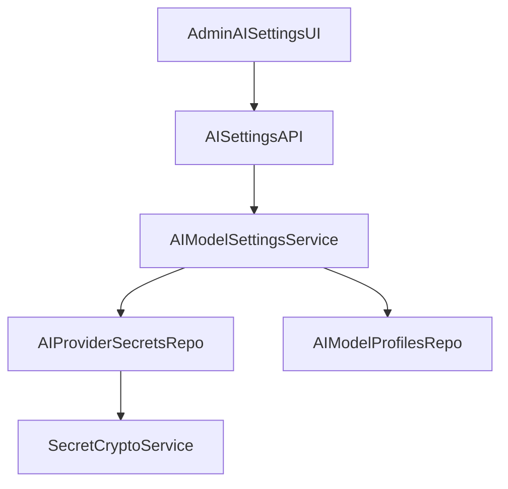

# AI Settings UX + Secrets Refinement Plan

## Scope Update
- Keep existing architecture for profiles/defaults and domain embedding lock.
- Add **encrypted DB-backed provider API key entry** for admin users.
- Replace duplicated profile naming with compact, single-line rendering.
- Polish settings-shell visuals to better match `DESIGN.md` (grayscale, flat, pill controls, 12px containers, low noise).

## Current Gaps Confirmed
- `AIModelSettingsPanel` currently duplicates label content (`display_name` + `model`) in multiple places and reads heavy in dense cards.
- Backend currently validates secrets from process env only; there is no admin path to enter/store provider keys.
- `providerkeys.png`/`dualnames.png` indicate two UX issues to fix immediately: inaccessible key entry and repeated model naming.

## Implementation Steps

### 1) Add encrypted secret storage model + migration
- Add a new table for provider secrets (e.g., `ai_provider_secrets`) with encrypted payload, provider key, timestamps, actor metadata.
- Add crypto helper/service (Fernet or equivalent) using app-level encryption key from config.
- Add migration revision after `0008_ai_model_settings`.
- Update settings validation path so profile readiness checks first consult encrypted stored secret, then env fallback.

Files:
- [app/storage/tables.py](app/storage/tables.py)
- [migrations/alembic/versions/0008_ai_model_settings.py](migrations/alembic/versions/0008_ai_model_settings.py) (reference only)
- `migrations/alembic/versions/0009_ai_provider_secrets.py` (new)
- `app/services/secret_crypto.py` (new)
- `app/core/config.py`

### 2) Extend admin AI settings API for key upsert/status
- Add endpoints for setting/clearing provider keys without returning raw values.
- Return normalized key status from DB-backed secrets + env fallback.
- Keep responses redacted (`present`/`missing`) and enforce admin-only access.

Files:
- [app/api/routes/ai_settings.py](app/api/routes/ai_settings.py)
- [app/schemas/ai_settings.py](app/schemas/ai_settings.py)
- [app/services/ai_model_settings_service.py](app/services/ai_model_settings_service.py)
- `app/storage/repositories/ai_provider_secrets.py` (new)

### 3) Redesign AI Models panel UX (compact + friendlier)
- Replace current profile cards with compact rows using one line format: `provider · model · dims`.
- Keep `display_name` editable in profile editor flow (if present), but avoid duplicate read-only render in list.
- Add provider key entry section (OpenAI, Bedrock, Ollama) with masked input + save/clear actions.
- Improve hierarchy:
  - Defaults card at top
  - Provider keys card second
  - Profiles list third with lighter spacing and fewer repeated labels

Files:
- [client/src/components/settings/panels/AIModelSettingsPanel.tsx](client/src/components/settings/panels/AIModelSettingsPanel.tsx)
- [client/src/lib/api/ai-settings.ts](client/src/lib/api/ai-settings.ts)
- [client/src/types/ai-settings.ts](client/src/types/ai-settings.ts)

### 4) Keep KG domain create dropdown concise
- Ensure embedding options use compact label format (`provider · model · dims`) to avoid repetition.
- Maintain locked-after-creation helper text and vertical field stack.

Files:
- [client/src/components/settings/panels/KnowledgeGraphSettingsPanel.tsx](client/src/components/settings/panels/KnowledgeGraphSettingsPanel.tsx)

### 5) Tests + regression checks
- Add backend tests for secret upsert/read-status/encryption behavior and admin authorization.
- Add/update frontend behavior tests if present; otherwise cover with lint + API contract tests.
- Re-run existing AI settings + lightrag embedding tests to ensure no regressions.

Files:
- [tests/test_ai_settings_api.py](tests/test_ai_settings_api.py)
- [tests/test_ai_model_settings_service.py](tests/test_ai_model_settings_service.py)
- `tests/test_ai_provider_secrets.py` (new)

## UX Guardrails (from DESIGN.md)
- Monochrome only; no decorative accent colors.
- No shadows anywhere in settings shell.
- 12px for containers; pill radius for interactive elements.
- Reduce text duplication; prefer terse metadata lines and clear section titles.

