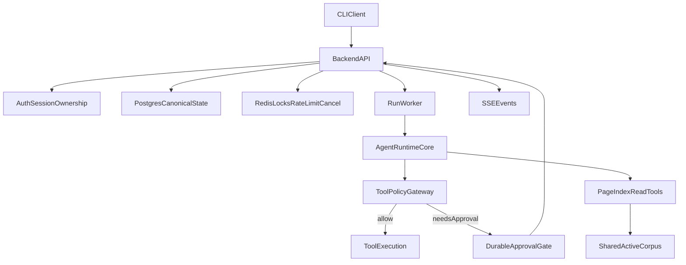

# Architecture Mental Model + Gap Closure Plan

## Locked Decisions (from grill)
- North star: backend-first multi-user platform; CLI is API client, local loop temporary.
- Migration: strangler around existing runtime core.
- Canonical state: Postgres ASAP.
- Tool safety: strict durable approvals before side effects.
- Deployment: single-host trusted LAN first.
- Frontend timing: CLI contract first.
- Corpus scope: admin-curated shared corpus first.
- Model strategy: single provider first.
- Cleanup posture: prune hard on duplicate/placeholder prototype paths.
- Release gate: correctness/security invariants first.

## Inferred Current System (what exists now)
- Working local agent runtime loop in [`d:/Projects/clawagent/src/agent/core/agent.py`](d:/Projects/clawagent/src/agent/core/agent.py) and CLI loop in [`d:/Projects/clawagent/src/cli/chat.py`](d:/Projects/clawagent/src/cli/chat.py).
- Filesystem JSONL conversation persistence in [`d:/Projects/clawagent/src/agent/core/history.py`](d:/Projects/clawagent/src/agent/core/history.py).
- Tool registry + builtins in [`d:/Projects/clawagent/src/agent/tools/registry.py`](d:/Projects/clawagent/src/agent/tools/registry.py) and [`d:/Projects/clawagent/src/agent/tools/builtin_tools.py`](d:/Projects/clawagent/src/agent/tools/builtin_tools.py).
- PageIndex library exists but not integrated into backend flow in [`d:/Projects/clawagent/src/pageindex/client.py`](d:/Projects/clawagent/src/pageindex/client.py).
- Critical code debt: duplicate/conflicting loader definitions in [`d:/Projects/clawagent/src/agent/core/agent_loader.py`](d:/Projects/clawagent/src/agent/core/agent_loader.py), placeholder LLM in [`d:/Projects/clawagent/src/agent/provider/llm.py`](d:/Projects/clawagent/src/agent/provider/llm.py), config load mismatch in [`d:/Projects/clawagent/src/cli/main.py`](d:/Projects/clawagent/src/cli/main.py) vs [`d:/Projects/clawagent/src/agent/utils/config.py`](d:/Projects/clawagent/src/agent/utils/config.py).

## Target Architecture Flow (agreed model)

## Gap Sequence (invariant-first)
1. Stabilize/prune runtime core debt so strangler base is reliable.
2. Stand up backend shell + auth/session + ownership endpoints.
3. Move canonical state to Postgres (conversations/messages/runs/approvals/audit).
4. Add Redis coordination (single-flight lock, idempotency helpers, cancel flags, rate limits).
5. Introduce run worker + lease/heartbeat + pause/resume model.
6. Implement strict tool gateway + durable HITL approval persistence.
7. Integrate shared admin-curated corpus pipeline + PageIndex read tools.
8. Add SSE run/approval/tool events + cancellation semantics.
9. Add observability/admin ops and release checks for correctness/security gates.
10. Keep frontend deferred until API/SSE contracts pass CLI contract tests.

## Agree/Disagree Checkpoints
- Checkpoint A: runtime strangler boundary (which modules stay pure runtime vs backend adapters).
- Checkpoint B: schema ownership for run lifecycle + approval records.
- Checkpoint C: exact lock semantics (conversation lock duration, stale-run takeover).
- Checkpoint D: approval UX contract (blocking states, timeout behavior, rejection payload format).
- Checkpoint E: corpus publish atomicity contract and rollback trigger.

## Immediate Next Planning Move
- Convert this into concrete implementation slices anchored to task docs:
  - [`d:/Projects/clawagent/docs/tasks/phase-0-stabilize-runtime.md`](d:/Projects/clawagent/docs/tasks/phase-0-stabilize-runtime.md)
  - [`d:/Projects/clawagent/docs/tasks/phase-1-backend-foundation.md`](d:/Projects/clawagent/docs/tasks/phase-1-backend-foundation.md)
  - [`d:/Projects/clawagent/docs/tasks/phase-2-persistence-concurrency.md`](d:/Projects/clawagent/docs/tasks/phase-2-persistence-concurrency.md)
  - [`d:/Projects/clawagent/docs/tasks/phase-4-tool-safety.md`](d:/Projects/clawagent/docs/tasks/phase-4-tool-safety.md)
  - [`d:/Projects/clawagent/docs/tasks/phase-5-streaming-cancellation.md`](d:/Projects/clawagent/docs/tasks/phase-5-streaming-cancellation.md)