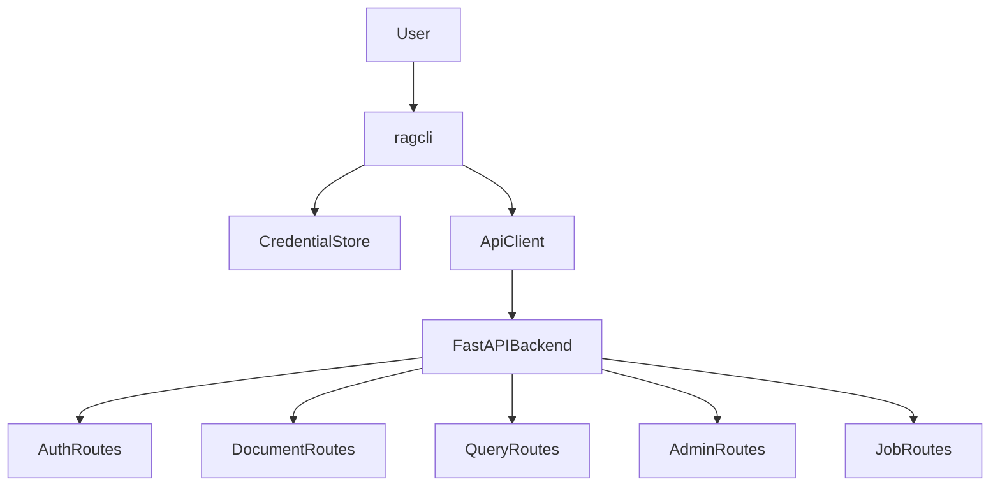

# Docs-First CLI Build Plan

## Ground Rules

- Source goal: [`.prompts/cli-build.md`](.prompts/cli-build.md), with TDD philosophy from [`.cursor/skills/engineering/tdd/SKILL.md`](.cursor/skills/engineering/tdd/SKILL.md).
- Target API: current backend routes, not `/v1` compatibility. Observed examples include `/auth/login`, `/auth/me`, `/documents`, `/documents/{document_id}/structure`, `/documents/{document_id}/pages/{page_number}`, `/query/retrieve`, `/query/answer`, `/admin/documents/upload`, and `/jobs/{job_id}`.
- CLI surface: document the full prompt surface, then implement it in prioritized vertical slices. Commands whose backend contract does not exist yet will be marked as planned in docs and built only when their backend behavior is added through public API tests.
- Test style: one behavior test through the public CLI/API surface, minimal implementation, repeat. No bulk test-writing ahead of implementation.

## Documentation First

Create `docs/cli_docs/` before non-doc implementation:

- [`docs/cli_docs/README.md`](docs/cli_docs/README.md): CLI purpose, install/run examples, `ragcli` command map, output modes, credentials, and local backend assumptions.
- [`docs/cli_docs/api-contract.md`](docs/cli_docs/api-contract.md): map each CLI command to the current backend endpoint, request/response shape, auth role, and status: supported now, backend gap, or planned.
- [`docs/cli_docs/commands.md`](docs/cli_docs/commands.md): full user-facing command reference from the prompt, adapted to current route names and current login field `email`.
- [`docs/cli_docs/tdd-build-plan.md`](docs/cli_docs/tdd-build-plan.md): vertical slices with one behavior per cycle, acceptance checks, and known gaps for missing backend contracts.
- [`docs/cli_docs/security-and-output.md`](docs/cli_docs/security-and-output.md): token storage, no password storage, no token printing, JSON output guarantees, admin-only command behavior.

Flow to document:

## Build Sequence

1. Add CLI package scaffolding and dependencies only after docs are in place:
   - Add `typer`, `rich`, and optional `keyring` to [`pyproject.toml`](pyproject.toml).
   - Add a `ragcli` console entry point.
   - Create a small `cli/` package rather than over-splitting immediately.

2. Port the reusable low-level pieces from [`.references/cli/api_client.py`](.references/cli/api_client.py), [`.references/cli/credentials.py`](.references/cli/credentials.py), and [`.references/cli/main.py`](.references/cli/main.py), adapted to current backend contracts:
   - Use `/auth/login` with `{email, password}`.
   - Use current unversioned paths.
   - Preserve JSON/human output and typed API errors.
   - Keep credentials keyring-first with local fallback warning.

3. TDD slice 1: auth and session lifecycle.
   - Behavior: `ragcli login --email admin@example.com` stores credentials without printing token.
   - Behavior: `ragcli logout` clears credentials.
   - Behavior: authenticated commands fail clearly when no login exists.

4. TDD slice 2: current document and retrieval commands.
   - `ragcli documents list/show/structure/page` mapped to current document routes.
   - `ragcli documents retrieve` mapped to `/query/retrieve`.
   - `ragcli documents answer` or `ragcli query` mapped to `/query/answer` and `/query`.
   - JSON output remains stable for automation.

5. TDD slice 3: current admin and job commands.
   - `ragcli admin documents upload` mapped to `/admin/documents/upload`.
   - `ragcli admin documents index/reindex/delete/list` mapped to existing admin routes.
   - `ragcli jobs list/status/retry` mapped to current job routes.
   - Tests verify normal users cannot use admin commands.

6. TDD slice 4: full prompt surface gap handling.
   - Add documented command stubs only when they give useful UX, returning a clear `not_supported_by_backend` error in JSON/human modes.
   - For `users`, `agents`, `retrievers`, `conversations`, `messages`, `chat`, `runs`, `approvals`, and corpus version publish/rollback/cleanup, add backend behavior first if we choose to make them real.
   - Each real backend addition starts with a public API behavior test in [`tests/test_api.py`](tests/test_api.py) or focused new test files.

7. Refactor while green.
   - Split into `cli/api`, `cli/auth`, `cli/commands`, `cli/ui`, and `cli/streaming` only as implementation depth justifies it.
   - Keep the CLI thin: request shaping, credential handling, output rendering, and no duplicated backend business logic.

## Verification

- Run targeted pytest after each slice, then full `python -m pytest -q` when the slice is complete.
- Run `ruff` if available after substantive edits.
- Smoke-test core CLI commands in JSON mode because that is the stable contract for scripts.
- Check edited files with lints after implementation changes.