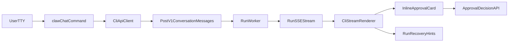

# Phase 5 CLI UX + Backend Integration Plan

## Confirmed Direction
- `chat` becomes backend API-backed (no local-runtime default flow).
- Target is full Phase 5: SSE streaming, cancellation, recovery, approvals UX.
- Command contract moves to canonical nested shape (`runs approvals list`, etc.) with hard cutover (no compatibility window).
- Deployment scope in this stream is PowerShell only (`scripts/deploy.ps1` + related docs).

## Current Gaps To Close
- Command surface is incomplete vs contract in [`docs/design/cli.md`](docs/design/cli.md) and [`docs/architecture/backend-api.md`](docs/architecture/backend-api.md): missing message send/list, run status/cancel, stream/recovery UX.
- `chat` currently bypasses backend in [`src/cli/chat.py`](src/cli/chat.py), conflicting with backend-first CLI contract.
- Command naming drift in [`src/cli/main.py`](src/cli/main.py) (hyphenated run-approval commands) vs canonical nested command model.
- Error/output consistency gaps for auth-required and noninteractive flows in [`src/cli/main.py`](src/cli/main.py) and [`src/cli/api_client.py`](src/cli/api_client.py).
- PowerShell deploy UX friction in [`scripts/deploy.ps1`](scripts/deploy.ps1) and [`scripts/README.md`](scripts/README.md) (flag ergonomics, first-run clarity, diagnostics).

## Target Architecture (CLI Runtime Path)

## Implementation Tracks

### 1) Contract and Docs Alignment
- Update command contract in [`docs/design/cli.md`](docs/design/cli.md) to match hard-cutover canonical commands and API-backed `chat` wrapper.
- Update phase notes/tasks in [`docs/tasks/phase-5-streaming-cancellation.md`](docs/tasks/phase-5-streaming-cancellation.md) with explicit CLI command map and noninteractive behavior.
- Set build-plan status transitions in [`docs/master-build-plan.md`](docs/master-build-plan.md) when implementation starts/completes.

### 2) Backend Endpoints for Phase 5 CLI
- Ensure/complete endpoints in [`src/backend/app.py`](src/backend/app.py):
  - `POST /v1/conversations/{conversation_id}/messages` with idempotency key.
  - Stream endpoint for run events (SSE).
  - `GET /v1/runs/{run_id}` for recovery/status.
  - `POST /v1/runs/{run_id}/cancel` for explicit cancellation.
  - `GET /v1/conversations/{conversation_id}/messages` for history recovery.
- Preserve typed error envelope and ownership/auth invariants.

### 3) CLI Command Surface Hard Cutover
- Refactor [`src/cli/main.py`](src/cli/main.py) command tree to canonical nested shape:
  - `chat` (API-backed streaming wrapper)
  - `messages send|list`
  - `runs status|cancel`
  - `runs approvals list|approve|reject`
- Remove/replace legacy hyphenated run-approval command naming.
- Keep `--output human|json` consistent across validation-critical commands.

### 4) Streaming Renderer + HITL UX
- Extend [`src/cli/api_client.py`](src/cli/api_client.py) with SSE-capable consumption path while retaining request/response JSON calls.
- Implement streaming renderer in [`src/cli/chat.py`](src/cli/chat.py) (or split helper module) for:
  - assistant deltas
  - compact tool status events
  - explicit typed denial/failure events
  - inline approval cards in interactive mode
  - noninteractive paused-run output (`run_id`, `approval_id`, resume commands)
- Ensure interrupted stream recovery messaging points to `runs status` + `messages list`.

### 5) Error and Output Consistency
- Standardize auth/session-required behavior in [`src/cli/main.py`](src/cli/main.py): typed code + actionable login guidance in both human and JSON modes.
- Enforce stdout/stderr discipline for machine-readable output stability.
- Ensure typed handling for `approval_required`, `tool_denied`, `rate_limited`, `run_cancelled`, timeouts.

### 6) PowerShell Deployment UX
- Improve [`scripts/deploy.ps1`](scripts/deploy.ps1) for clearer onboarding/diagnostics:
  - robust argument handling and explicit docs-aligned examples
  - first-run `.venv` guidance
  - dependency health progress messages and better failure context
  - clear foreground semantics for `up`
- Update [`scripts/README.md`](scripts/README.md) with PowerShell-first canonical usage and troubleshooting.

## Verification Strategy
- Extend/add tests in [`tests/`](tests/) for:
  - SSE stream happy path + interruption recovery
  - cancel endpoint behavior and terminal statuses
  - approval pause/resume via CLI commands
  - canonical command routing and JSON output stability
  - auth/session error UX and typed error code coverage
- Add CLI smoke script path through deploy + API-backed `chat` + approval + cancel flow.

## Deliverable Order
1. Backend Phase 5 API primitives stable.
2. CLI command-tree hard cutover to canonical commands.
3. API-backed `chat` + streaming renderer + approval/recovery behavior.
4. Output/error normalization.
5. PowerShell deploy UX tightening and docs updates.
6. Full targeted tests and smoke validation.
