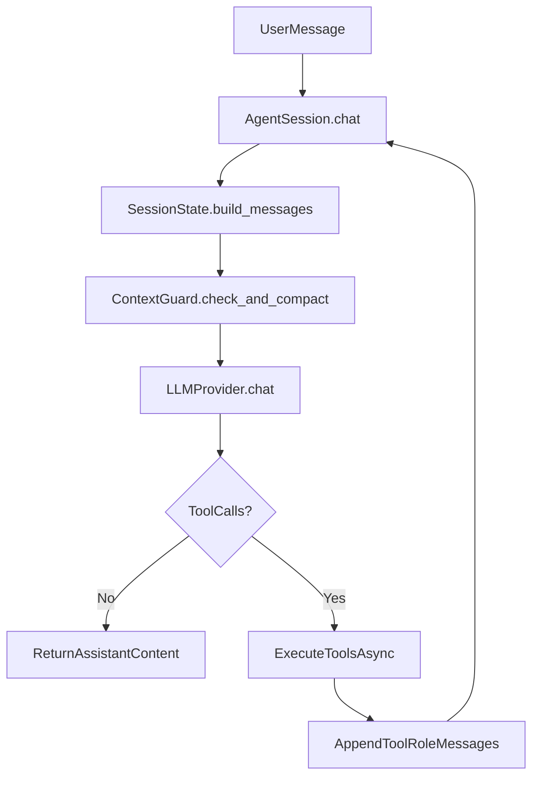

# Core Comments + Architecture Mental Models

## Goal
Make `agent/core` easier for junior devs by adding high-signal comments that explain runtime intent, data flow, and invariants, while also introducing docs in `agent/core/_docs` that comments can point to.

## Scope
- Update comments in:
  - [d:/Projects/clawagent/agent/core/agent.py](d:/Projects/clawagent/agent/core/agent.py)
  - [d:/Projects/clawagent/agent/core/context_guard.py](d:/Projects/clawagent/agent/core/context_guard.py)
  - [d:/Projects/clawagent/agent/core/history.py](d:/Projects/clawagent/agent/core/history.py)
  - [d:/Projects/clawagent/agent/core/session_state.py](d:/Projects/clawagent/agent/core/session_state.py)
  - [d:/Projects/clawagent/agent/core/skill_loader.py](d:/Projects/clawagent/agent/core/skill_loader.py)
  - [d:/Projects/clawagent/agent/core/__init__.py](d:/Projects/clawagent/agent/core/__init__.py)
- Create new docs folder + architecture mental-model docs:
  - [d:/Projects/clawagent/agent/core/_docs/README.md](d:/Projects/clawagent/agent/core/_docs/README.md)
  - [d:/Projects/clawagent/agent/core/_docs/runtime-flow.md](d:/Projects/clawagent/agent/core/_docs/runtime-flow.md)
  - [d:/Projects/clawagent/agent/core/_docs/persistence-and-compaction.md](d:/Projects/clawagent/agent/core/_docs/persistence-and-compaction.md)

## Commenting Approach
- Keep comments short, local, and intent-first (why before what).
- Focus on junior confusion points:
  - Session lifecycle (`Agent.new_session()` -> `AgentSession.chat()` loop)
  - Tool-call roundtrip (`LLM -> tool execution -> tool message back to LLM`)
  - Context guard stages (estimate -> truncate tool payloads -> summarize)
  - Persistence side effects (`SessionState.add_message()` writes immediately)
  - Skill discovery + validation failure paths
- Avoid noisy comments on obvious assignments or simple returns.
- Add lightweight cross-links in comments like `See: core/_docs/runtime-flow.md` where extra context helps.

## Architecture Flow (to document + mirror in comments)

## File-by-File Focus
- `agent.py`
  - Annotate chat loop phases and retry/continue logic.
  - Clarify why assistant message is stored before tool execution.
- `context_guard.py`
  - Explain compaction thresholds and safe truncation intent.
  - Explain summary insertion strategy and downstream effect.
- `history.py`
  - Explain JSONL model shapes and index/session update coupling.
  - Clarify title auto-generation and ordering by `updated_at`.
- `session_state.py`
  - Highlight dual write path (memory + durable history) and why it matters.
- `skill_loader.py`
  - Clarify discovery callback contract and validation error handling.
- `__init__.py`
  - Short comment on package-level exports purpose.

## Verification
- Run lints on edited files and fix any new issues.
- Quick consistency pass: comments should not drift from code behavior.
- Verify all doc links referenced by comments exist and use correct paths.