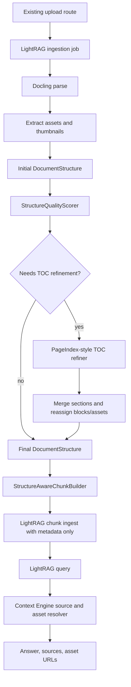

# End-to-End Document Processing Implementation Plan

## Current Baseline

The branch already has the first vertical slice in place:

- Canonical models and persistence in [app/document_processing/models.py](app/document_processing/models.py) and [app/storage/repositories/document_processing.py](app/storage/repositories/document_processing.py).
- LightRAG ingestion orchestration in [app/services/lightrag_ingestion_service.py](app/services/lightrag_ingestion_service.py).
- `DoclingParser`, `DocumentStructureBuilder`, `AssetExtractor`, placeholder thumbnails, and asset hash deduplication in [app/document_processing/docling_parser.py](app/document_processing/docling_parser.py).
- `StructureAwareChunkBuilder` with section grouping, page ranges, inherited assets, and section title/path metadata in [app/document_processing/chunk_builder.py](app/document_processing/chunk_builder.py).
- Canonical debug APIs and CLI/TUI debug surfaces are partially wired.

The remaining implementation should follow this data flow:

## Phase 1: Harden Real Docling PDF Parsing

Goal: make [app/document_processing/docling_parser.py](app/document_processing/docling_parser.py) reliable against real Docling output shapes, not only fakes.

- Add small golden fixtures or fake Docling result shapes for reliable headings, figures with captions, tables, images without captions, and page metadata.
- Normalize Docling item labels into stable `DocumentBlock.type` values: heading, paragraph, table, figure, image, caption, page header/footer, and unknown.
- Preserve reading order, bounding boxes, page numbers, caption text, and nearby text where available.
- Keep the current fallback rule: if Docling is unavailable or parsing fails, raw LightRAG upload fallback can still proceed.
- Add tests in [tests/test_document_processing_pipeline.py](tests/test_document_processing_pipeline.py) for parser-output variations and warning behavior.

## Phase 2: Finish Asset Extraction Quality

Goal: produce useful first-class assets while still returning URLs, not bytes, from APIs.

- Replace placeholder thumbnail copying in `ThumbnailGenerator` with real image resizing, max width 512 px, preserving aspect ratio.
- Add table snapshot support where Docling exposes a renderable image for table regions.
- Improve deterministic linking rules: image block, caption block, nearest same-page text block, containing section by page range.
- Keep content-hash deduplication, but ensure each occurrence can retain its own `block_id`, `section_id`, `caption`, and `nearby_text`.
- Expand asset tests for duplicate assets, table images, uncaptained images, thumbnail dimensions, and path confinement.

## Phase 3: Implement PageIndex-Style TOC Refinement Services

Goal: replace the current validation-only scaffolding in [app/document_processing/refinement.py](app/document_processing/refinement.py) with bounded, testable services.

- Split or extend refinement code into small services matching the docs: `TocPageDetector`, `TocJsonExtractor`, `PageOffsetResolver`, `SectionStartValidator`, `SectionRangeAssigner`, and `TocRefiner`.
- Keep LLM calls behind an injectable boundary so unit tests use mocked responses.
- Support `enable_toc_refinement` modes: `auto`, `always`, and `never`.
- Enforce `max_llm_calls`, JSON-only outputs, page bounds, hierarchy sanity, and `min_acceptance_accuracy`.
- Persist accepted/rejected reports through [app/storage/repositories/document_processing.py](app/storage/repositories/document_processing.py) and [app/document_processing/artifacts.py](app/document_processing/artifacts.py).

## Phase 4: Merge Refined Sections Back Into Docling Structure

Goal: make TOC refinement improve the canonical structure without replacing Docling-owned blocks/assets.

- Add `StructureMerger`, `BlockSectionAssigner`, and `AssetSectionAssigner` under document processing.
- Preserve Docling blocks, text, assets, paths, hashes, captions, page metadata, and source file metadata.
- Replace or repair section titles, levels, parent/child relationships, page ranges, and block-to-section assignment only when the refiner is accepted.
- Recompute section `block_ids`, asset `section_id`, and later chunk `section_id` after merge.
- Add tests for accepted refinement, rejected refinement, page-offset correction, overlapping ranges, and assets staying linked after reassignment.

## Phase 5: Tune Chunking And LightRAG Metadata

Goal: make chunk text and metadata robust for real manuals while keeping LightRAG as the only semantic owner.

- Tune [app/document_processing/chunk_builder.py](app/document_processing/chunk_builder.py) for real Docling blocks: large tables, figure-only blocks, caption blocks, and long sections.
- Decide whether chunk text should prepend a compact section path such as `Section: Maintenance > Hydraulic Service` while keeping metadata authoritative.
- Keep metadata-only asset references in [app/integrations/lightrag_remote_adapter.py](app/integrations/lightrag_remote_adapter.py); never send image bytes/base64 to LightRAG.
- Add tests for chunk sizing, figure-only chunks, section path text, asset inheritance, and adapter payload shape.

## Phase 6: Complete Retrieval Asset Resolution

Goal: query results should return answer evidence plus relevant image/table assets.

- Harden [app/services/retrieval_asset_resolver.py](app/services/retrieval_asset_resolver.py) against actual LightRAG response metadata: `chunk_id`, `source_chunk_id`, partial page fields, missing asset IDs, and duplicate evidence.
- Rank assets using direct chunk link, block link, caption/query overlap, same page, same section, then nearby page range.
- Enforce `include_assets`, `include_thumbnails`, and `max_assets` defaults.
- Ensure response assets include authenticated thumbnail/full asset URLs, not file bytes.
- Add integration-style tests using mocked LightRAG responses with figures and tables.

## Phase 7: Fill API And Admin Gaps

Goal: expose the final control plane cleanly through existing document/query routes.

- Keep existing upload/query contracts unless the current route layer already has the equivalent domain-aware endpoint.
- Add or complete upload options for `enable_toc_refinement=auto|always|never` and persist them in document metadata.
- Add admin actions if still missing: rebuild structure and reingest LightRAG, using the same job pipeline and access controls.
- Complete debug endpoints from [docs/brainstorm/lightrag_toc_refiner_image_aware_docs/09_api_contracts.md](docs/brainstorm/lightrag_toc_refiner_image_aware_docs/09_api_contracts.md): structure, section, chunk, assets, structure quality, TOC report, ingestion status.
- Verify asset and thumbnail streaming remains authenticated and path-confined.

## Phase 8: Finish CLI/TUI Debug Workflow

Goal: let an operator inspect ingestion quality without reading raw JSON or database rows.

- Extend [cli/tui/screens/content.py](cli/tui/screens/content.py), [cli/services/documents.py](cli/services/documents.py), and related screen builders to show assets, chunks, TOC reports, and quality warnings.
- Add actions to navigate from document detail to structure, section, chunk, and asset metadata views.
- Add admin-only affordances for rebuild/reingest if the backend admin actions are implemented.
- Keep image display simple in v1: show URL/path/caption/metadata, optionally open externally later.

## Phase 9: End-to-End Verification And Hardening

Goal: prove the full path works without broad flaky test runs blocking development.

- Build a focused fixture suite matching [docs/brainstorm/lightrag_toc_refiner_image_aware_docs/12_testing_strategy.md](docs/brainstorm/lightrag_toc_refiner_image_aware_docs/12_testing_strategy.md): clean Markdown, reliable PDF headings, TOC with offset, weak headings with good TOC, figures, tables, and uncaptained images.
- Keep targeted pytest commands per area during development, then run a broader suite once imports/database setup are stable.
- Add regression tests for raw upload fallback, Docling parse fallback, rejected TOC refinement, accepted TOC refinement, and retrieval with assets.
- Run Ruff and linter diagnostics on each edited slice.
- Update [docs/implementation-status.md](docs/implementation-status.md) and [docs/brainstorm/lightrag_toc_refiner_image_aware_docs/15_fresh_agent_handoff.md](docs/brainstorm/lightrag_toc_refiner_image_aware_docs/15_fresh_agent_handoff.md) after every meaningful slice.

## Non-Goals For V1

Do not add image embeddings, CLIP/vector image search, duplicate local semantic chunk tables, image bytes in LightRAG metadata, a second PageIndex workspace, S3/MinIO storage, or a parallel document-navigation API.