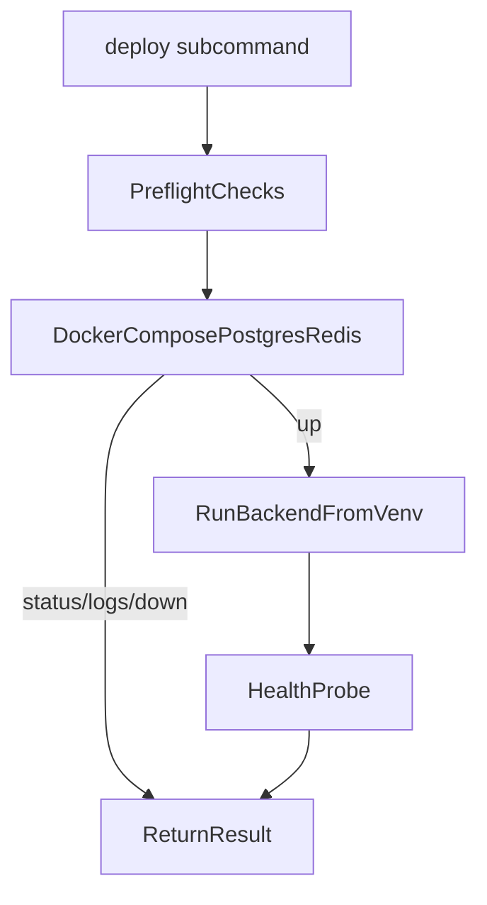

# Lean Deploy Scripts Plan

## Goal
Create minimal `PowerShell` and `bash` entrypoint scripts in `scripts/` that manage Postgres/Redis dependencies and backend runtime using the repo `.venv` plus `uv`, without touching the attached plan file.

## Confirmed Decisions
- Scope includes:
  - dependencies operations (`up/down/logs/status`)
  - combined startup path (deps + backend)
  - teardown path
- Runtime model:
  - use `uv` for setup (`uv sync`/environment validation)
  - run backend with explicit `.venv` Python invocation
- Script layout:
  - one single entrypoint per shell with subcommands

## Files To Add
- [d:/Projects/clawagent/scripts/deploy.ps1](d:/Projects/clawagent/scripts/deploy.ps1)
- [d:/Projects/clawagent/scripts/deploy.sh](d:/Projects/clawagent/scripts/deploy.sh)
- [d:/Projects/clawagent/scripts/README.md](d:/Projects/clawagent/scripts/README.md)

## Script Contract
Both entrypoints expose the same subcommands and behavior:
- `up`:
  - verify `docker compose`, `uv`, and `.venv` prerequisites
  - run `docker compose up -d postgres redis`
  - wait for dependency health checks
  - ensure env sync (`uv sync` if needed)
  - run backend via `.venv` Python (`python -m backend.main` equivalent)
- `deps-up`:
  - start only Postgres/Redis in detached mode
- `deps-down`:
  - stop only Postgres/Redis
- `logs`:
  - stream dependency logs (`postgres`, `redis`)
- `status`:
  - show compose service status + backend readiness hint (`/health` curl if available)
- `down`:
  - stop deps and terminate backend process if started by script session

## Implementation Details
- Resolve repo root from script location (no hardcoded absolute paths).
- Keep commands explicit and short; avoid hidden side effects.
- Use stable exit codes:
  - `0` success
  - `1` invalid command / prereq missing / failed operation
- Keep backend host/port default to existing local behavior (`127.0.0.1:8000`), with optional override flags:
  - `--host`, `--port`, `--workspace`
- Avoid adding process managers; keep foreground backend process for simplicity.

## Safety and UX Guardrails
- Print concise preflight summary before actions.
- Fail fast if `.venv` is missing instead of creating ad hoc environments.
- Do not run destructive docker prune/remove-volume operations.
- Ensure PowerShell and bash semantics match closely so docs stay simple.

## Validation Plan
- Command smoke checks:
  - `scripts/deploy.ps1 status`
  - `scripts/deploy.ps1 deps-up`
  - `scripts/deploy.ps1 up --workspace default_workspace`
  - `scripts/deploy.ps1 down`
  - same sequence with `scripts/deploy.sh`
- Backend health verification during `up`:
  - `GET /health` returns `{"status":"ok"}`
- Confirm no regressions to existing test suite invocation (`python -m pytest -q`).

## Execution Flow

## Notes
- No modifications will be made to the attached `.plan.md` file.
- Existing todo tracking should be reused in execution phase (no duplicate todo creation).