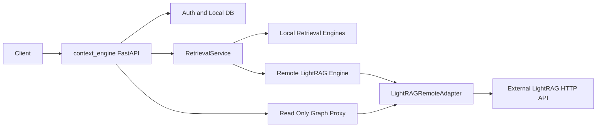

# LightRAG TDD Build Plan

## Scope
Build the full v1 integration from [docs/lightrag_docs](docs/lightrag_docs), with runtime behavior controlled by `LIGHTRAG_ENABLED`.

Key boundaries:

- `context_engine` remains the app of record for auth, users, local document mirror records, query routes, audit logs, and stable response shapes.
- External LightRAG remains HTTP-only; no imports from [external/lightrag](external/lightrag) into app runtime code.
- Graph proxy routes should match the bundled LightRAG repo's read-only route names: `/graphs`, `/graph/label/list`, `/graph/label/popular`, and `/graph/label/search`. Do not add graph edit routes in v1.

## Existing Anchors

- Settings live in [app/core/config.py](app/core/config.py); defaults must keep LightRAG disabled.
- Query route behavior flows through [app/api/routes/query.py](app/api/routes/query.py) -> [app/services/retrieval_service.py](app/services/retrieval_service.py) -> [app/retrieval/router.py](app/retrieval/router.py).
- Admin upload currently goes through [app/api/routes/admin.py](app/api/routes/admin.py) -> [app/services/document_service.py](app/services/document_service.py).
- Existing regression coverage is in [tests/test_api.py](tests/test_api.py).
- The local semantic adapter in [app/integrations/lightrag_adapter.py](app/integrations/lightrag_adapter.py) should remain the disabled-mode fallback.

## TDD Sequence

1. RED: Add/keep a regression test proving `LIGHTRAG_ENABLED=false` preserves the current admin upload and query flow. GREEN: add safe LightRAG settings in [app/core/config.py](app/core/config.py) and `.env.example` only; do not wire runtime behavior yet.
2. RED: Add a domain/config resolution test for missing manifests and default domain/base URL behavior. GREEN: add [app/integrations/lightrag_domains.py](app/integrations/lightrag_domains.py) with read-only resolution.
3. RED: Add adapter tests with `httpx.MockTransport` for `/query/data` normalization into existing `Evidence` objects. GREEN: add [app/integrations/lightrag_remote_adapter.py](app/integrations/lightrag_remote_adapter.py), typed adapter errors, auth header support, and mode mapping (`semantic`/`hybrid`/`auto` -> `mix`).
4. RED: Add a route-level test proving `POST /query/retrieve` returns remote evidence when `LIGHTRAG_ENABLED=true`. GREEN: add a remote retrieval engine or service branch behind the feature flag while preserving the local fallback.
5. RED: Add route-level tests for admin upload forwarding to mocked `/documents/upload`, and normal-user upload remaining `403`. GREEN: extend the document service/repository minimally to store external LightRAG metadata in the existing document `metadata` field and skip/alter local indexing only for remote-enabled uploads as needed.
6. RED: Add adapter tests for `/documents/track_status/{track_id}` status normalization. GREEN: expose status metadata through the existing local mirror model without adding a new registry table.
7. RED: Add authenticated graph proxy tests for upstream read-only routes: `/graphs`, `/graph/label/list`, `/graph/label/popular`, `/graph/label/search`. GREEN: add a small graph proxy router and include it in [app/main.py](app/main.py), using the remote adapter for HTTP calls.
8. RED: Add failure-mapping tests for timeout, invalid JSON, auth failure, 4xx, and 5xx. GREEN: translate typed adapter errors into stable FastAPI errors without leaking upstream traces.
9. RED/GREEN optional contract check: add [external/lightrag/contract/openapi.yaml](external/lightrag/contract/openapi.yaml) and examples only if useful for CI/docs. Otherwise treat docs verification as manual.
10. Refactor only while GREEN: remove normalization duplication, keep the adapter interface small, and run focused tests after each cycle, then the full suite.

## Verification

Run targeted tests after each cycle, then run the full test suite with `pytest`. Use mocked HTTP only; no Docker or live LightRAG service should be required for tests.