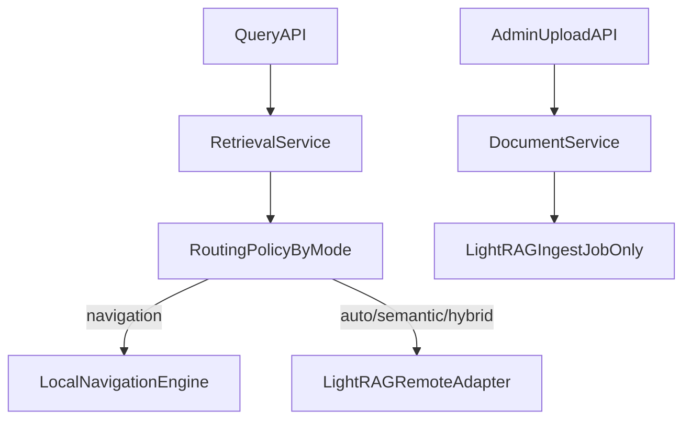

# Enforce Mandatory Remote LightRAG Semantic Retrieval

## Target Outcome
- Semantic retrieval is always remote via LightRAG.
- `LIGHTRAG_ENABLED` is treated as effectively always-on for semantic paths.
- No local semantic fallback path remains in runtime behavior or developer-facing docs.
- Navigation-only retrieval remains local (`mode=navigation`) as a separate non-semantic capability.

## Current Ambiguity To Remove
- Runtime config still defaults `lightrag_enabled` to `False` in [/data/home/tkodippili/Desktop/localTest_context_engine/app/core/config.py](/data/home/tkodippili/Desktop/localTest_context_engine/app/core/config.py).
- Retrieval orchestration still contains disabled-mode conditional logic in [/data/home/tkodippili/Desktop/localTest_context_engine/app/services/retrieval_service.py](/data/home/tkodippili/Desktop/localTest_context_engine/app/services/retrieval_service.py).
- Routing policy still accepts a now-misleading `lightrag_enabled` argument but ignores it in [/data/home/tkodippili/Desktop/localTest_context_engine/app/retrieval/routing_policy.py](/data/home/tkodippili/Desktop/localTest_context_engine/app/retrieval/routing_policy.py).
- Upload flow still branches on `self.settings.lightrag_enabled` in [/data/home/tkodippili/Desktop/localTest_context_engine/app/services/document_service.py](/data/home/tkodippili/Desktop/localTest_context_engine/app/services/document_service.py).

Key snippets driving confusion today:
```python
# app/retrieval/routing_policy.py
def resolve(self, *, lightrag_enabled: bool, mode: RetrievalMode) -> RetrievalRoute:
    del lightrag_enabled
```

```python
# app/services/retrieval_service.py
if not self.settings.lightrag_enabled and request.mode != RetrievalMode.NAVIGATION:
    raise HTTPException(status_code=400, detail="LightRAG is required for semantic retrieval")
```

## Planned Minimal Code Changes
1. **Make runtime default explicit and mandatory**
   - Update [/data/home/tkodippili/Desktop/localTest_context_engine/app/core/config.py](/data/home/tkodippili/Desktop/localTest_context_engine/app/core/config.py): set `lightrag_enabled: bool = True`.
   - Add a short clarifying comment/docstring near this field that semantic retrieval is remote-LightRAG-only.

2. **Simplify retrieval orchestration by removing disabled semantic branch**
   - Update [/data/home/tkodippili/Desktop/localTest_context_engine/app/services/retrieval_service.py](/data/home/tkodippili/Desktop/localTest_context_engine/app/services/retrieval_service.py):
     - remove the `if not self.settings.lightrag_enabled ...` gate for non-navigation modes,
     - call routing policy solely by mode,
     - keep existing remote adapter error mapping (`LightRAGAdapterError -> 502/503`) unchanged.

3. **Delete dead routing flag parameter**
   - Update [/data/home/tkodippili/Desktop/localTest_context_engine/app/retrieval/routing_policy.py](/data/home/tkodippili/Desktop/localTest_context_engine/app/retrieval/routing_policy.py):
     - remove `lightrag_enabled` from `resolve(...)` signature,
     - remove `del lightrag_enabled`,
     - preserve behavior: `navigation -> LOCAL`, `auto|semantic|hybrid -> LIGHTRAG`.
   - Update all callers and tests accordingly.

4. **Remove upload fallback branch**
   - Update [/data/home/tkodippili/Desktop/localTest_context_engine/app/services/document_service.py](/data/home/tkodippili/Desktop/localTest_context_engine/app/services/document_service.py):
     - remove the local upload/index branch under `if self.settings.lightrag_enabled`.
     - always execute the existing `_upload_remote(...)` path.
   - Keep existing validation (`semantic_engine == "lightrag"`) and domain checks unchanged.

## Tests To Update (Minimal, High Signal)
- Update [/data/home/tkodippili/Desktop/localTest_context_engine/tests/test_retrieval_routing_policy.py](/data/home/tkodippili/Desktop/localTest_context_engine/tests/test_retrieval_routing_policy.py):
  - remove enabled/disabled duplicate parametrized tests,
  - assert mode-based routing only.
- Update [/data/home/tkodippili/Desktop/localTest_context_engine/tests/test_api.py](/data/home/tkodippili/Desktop/localTest_context_engine/tests/test_api.py):
  - remove/adjust assertions that expect default `lightrag_enabled is False`,
  - keep API flow coverage using adapter stubs/monkeypatch where needed.
- Update any failing tests that still pass `lightrag_enabled=` into `resolve(...)`.

## Docs To Realign (Only Canonical Files)
- Update [/data/home/tkodippili/Desktop/localTest_context_engine/docs/architecture.md](/data/home/tkodippili/Desktop/localTest_context_engine/docs/architecture.md):
  - remove wording/diagram implying "LightRAG-disabled semantic request" routes locally.
- Update [/data/home/tkodippili/Desktop/localTest_context_engine/docs/junior_dev_start_here.md](/data/home/tkodippili/Desktop/localTest_context_engine/docs/junior_dev_start_here.md):
  - state semantic retrieval is always remote LightRAG,
  - remove stale reference to `app/retrieval/semantic_engine.py`.
- Update [/data/home/tkodippili/Desktop/localTest_context_engine/docs/deployment.md](/data/home/tkodippili/Desktop/localTest_context_engine/docs/deployment.md):
  - treat `LIGHTRAG_ENABLED` as required runtime assumption rather than optional semantic switch.

## Behavior After Change


## Verification
- Run targeted tests for retrieval routing and API behavior.
- Run full test subset touching upload/retrieval if needed.
- Run lint diagnostics on edited files and fix any introduced issues.
- Confirm no remaining references to local semantic fallback language in updated canonical docs.