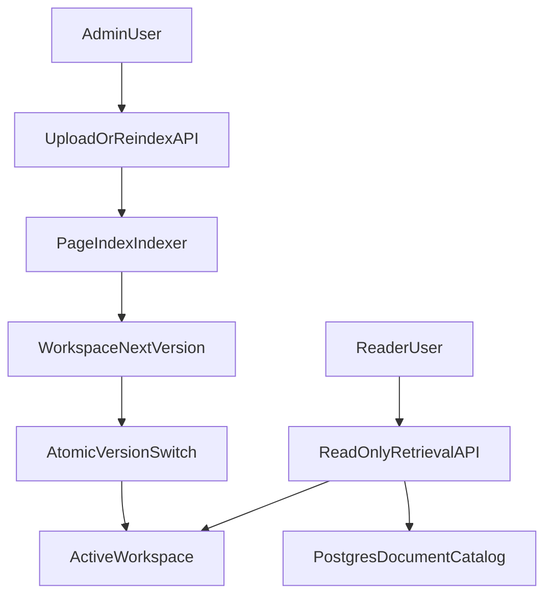

# PageIndex Brainstorm Doc Plan

## Goal
Create `@docs/brainstorm/page-index.md` as junior-dev guide for `@pageindex`: how current system works, how data moves, what schema exists/missing, and how to adapt with minimal infra for multiuser read access.

## Source Grounding
- Explain from current implementation in [`d:\Projects\clawagent\pageindex\client.py`](d:\Projects\clawagent\pageindex\client.py), [`d:\Projects\clawagent\pageindex\page_index.py`](d:\Projects\clawagent\pageindex\page_index.py), [`d:\Projects\clawagent\pageindex\retrieve.py`](d:\Projects\clawagent\pageindex\retrieve.py).
- Align DB discussion to current documented schema in [`d:\Projects\clawagent\docs\database-schema.md`](d:\Projects\clawagent\docs\database-schema.md).
- Clarify gap: PageIndex persistence currently filesystem JSON workspace, not Postgres tables.

## Planned Doc Structure
1. **What `@pageindex` is (junior framing)**
   - Problem solved (document structure-first retrieval).
   - Key concepts: `doc_id`, structure tree, page ranges, summaries.

2. **Current Architecture (as-is)**
   - Components: indexing pipeline, workspace storage, retrieval APIs.
   - Responsibilities of `PageIndexClient` and retrieve helpers.
   - Explicitly state current single-process/single-tenant assumptions.

3. **Information Flow (end-to-end)**
   - Ingest flow: admin upload -> indexing -> workspace artifacts.
   - Read flow: user picks doc -> structure fetch -> page-range content fetch.
   - Traversal loop: iterative structure narrowing using `start_index/end_index`.

4. **Mermaid Architecture + Flow Diagrams**
   - One high-level component diagram.
   - One sequence/flow diagram for admin publish + user retrieval.

5. **Database Schema (v1 chosen design)**
   - Keep indexed payload in workspace JSON.
   - Add lean Postgres catalog table(s) only for listing/version metadata.
   - Include proposed minimal table design and field rationale.
   - Explain why no full page/chunk table yet.

6. **Lean Multiuser Modification Plan (5-10 users)**
   - Chosen decisions:
     - storage: workspace + Postgres catalog
     - corpus: single shared corpus for all readers
     - publish: atomic version swap
     - traversal: structure + page-range fetch only
   - Required backend boundaries: admin-write endpoints, user-read endpoints.
   - Operational safety: immutable version dirs + pointer flip.

7. **Decision Log With Pros/Cons + Recommendation**
   - Compare selected path vs alternatives (in-place update, object-store-first, keyword search v1).
   - Provide recommendation and explicit “why now / why later”.

8. **Code Orientation Map for juniors**
   - “Read these files in this order” section with short intent notes.
   - Common debugging checkpoints (missing doc_id, stale workspace, version mismatch).

9. **Phased Delivery**
   - Phase 0: document existing behavior.
   - Phase 1: add catalog + publish protocol.
   - Phase 2: optional enhancements (search, ACL scopes, object storage).

## Non-Goals (for clarity)
- No full RAG/vector DB migration in v1.
- No per-user ACL model in v1 (single shared corpus).
- No agentic traversal requirement in v1 API.

## Acceptance Criteria for Doc
- Junior dev can explain architecture and data flow without reading code first.
- Team can implement minimal multiuser support with low infra changes.
- Tradeoffs and recommended path are explicit and actionable.