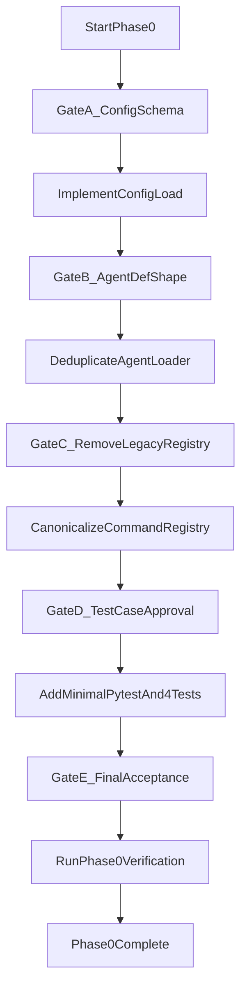

# Phase 0 Runtime Stabilization Plan

## Scope Lock
- Execute only Phase 0 from [d:\Projects\clawagent\docs\tasks\phase-0-stabilize-runtime.md](d:\Projects\clawagent\docs\tasks\phase-0-stabilize-runtime.md).
- Preserve current `AgentSession.chat()` loop semantics per [d:\Projects\clawagent\docs\index.md](d:\Projects\clawagent\docs\index.md).
- Keep all backend/persistence/auth/tool-policy expansion out of scope.

## Confirmed Decision Baseline (Already Chosen)
- `Config.load(...)`: **add/restore API** instead of changing CLI call pattern.
- Legacy command placeholder (`agent/core/commands`): **remove now** (single canonical path).
- `AgentDef` model: **dataclass** (no Pydantic model retained).
- Testing: **minimal pytest setup** with **4 focused Phase 0 tests**.
- Config behavior: **strict fail** on invalid/missing required fields.
- Test layout: **top-level `tests/`** package.
- Decision-gate mode: **stop on each meaningful fork**.

## Implementation Sequence
1. **Stabilize config contract first**
   - Update [d:\Projects\clawagent\src\agent\utils\config.py](d:\Projects\clawagent\src\agent\utils\config.py) to add a strict `Config.load(workspace_path)` constructor path.
   - Ensure required fields for runtime startup are explicit and validated.
   - Keep behavior minimal and predictable for junior maintainers (clear errors, no hidden fallback magic).

2. **Remove duplicate loader implementation**
   - Consolidate [d:\Projects\clawagent\src\agent\core\agent_loader.py](d:\Projects\clawagent\src\agent\core\agent_loader.py) to one authoritative dataclass-based `AgentDef` + `AgentLoader` implementation.
   - Remove duplicate block and normalize file read/validation behavior.

3. **Prune legacy command registry path**
   - Remove placeholder path usage under [d:\Projects\clawagent\src\agent\core\commands\registry.py](d:\Projects\clawagent\src\agent\core\commands\registry.py) and keep [d:\Projects\clawagent\src\agent\commands\registry.py](d:\Projects\clawagent\src\agent\commands\registry.py) as canonical.
   - Verify imports across runtime remain unambiguous.

4. **Add Phase 0-focused tests with minimal harness**
   - Add pytest scaffolding and top-level `tests/` structure.
   - Add targeted tests for:
     - config bootstrap/loading,
     - loader single-definition behavior,
     - command registry routing,
     - baseline chat loop with placeholder provider.

5. **Run verification against Phase 0 exit gates**
   - Confirm CLI no longer calls undefined config APIs.
   - Confirm single authoritative loader implementation.
   - Confirm one authoritative command registry path.
   - Confirm focused tests pass.

6. **Record decisions when architecture-level behavior changes**
   - If Phase 0 implementation introduces/changes architectural policy, append a new entry in [d:\Projects\clawagent\docs\decisions\log.md](d:\Projects\clawagent\docs\decisions\log.md) in existing style.

## Human Intervention Gates (Stop-and-Confirm)
- **Gate A (before coding config loader):** exact required config keys + strict error message format.
- **Gate B (after config done, before loader cleanup):** final dataclass field/validation shape for `AgentDef`.
- **Gate C (before deleting legacy registry file/path):** confirm no compatibility shim needed.
- **Gate D (before tests are finalized):** approve exact 4 test cases and naming/layout.
- **Gate E (before final verification run):** confirm acceptance checklist and any doc/log updates.

## Execution Map

## Primary Files Expected To Change
- [d:\Projects\clawagent\src\agent\utils\config.py](d:\Projects\clawagent\src\agent\utils\config.py)
- [d:\Projects\clawagent\src\cli\main.py](d:\Projects\clawagent\src\cli\main.py) (if only minor alignment needed)
- [d:\Projects\clawagent\src\agent\core\agent_loader.py](d:\Projects\clawagent\src\agent\core\agent_loader.py)
- [d:\Projects\clawagent\src\agent\core\commands\registry.py](d:\Projects\clawagent\src\agent\core\commands\registry.py)
- [d:\Projects\clawagent\tests\](d:\Projects\clawagent\tests\) (new)
- [d:\Projects\clawagent\docs\decisions\log.md](d:\Projects\clawagent\docs\decisions\log.md) (only if a new architecture-level decision is introduced)
