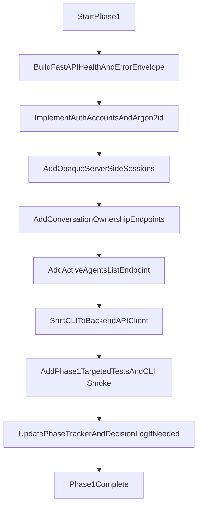

# Phase 1 Backend Foundation Plan

## Scope
- Execute only Phase 1 from [d:\Projects\clawagent\docs\tasks\phase-1-backend-foundation.md](d:\Projects\clawagent\docs\tasks\phase-1-backend-foundation.md).
- Keep runtime-core semantics stable per [d:\Projects\clawagent\docs\architecture\system.md](d:\Projects\clawagent\docs\architecture\system.md) and [d:\Projects\clawagent\docs\architecture\backend-api.md](d:\Projects\clawagent\docs\architecture\backend-api.md).
- Keep full persistence/concurrency guarantees scoped to Phase 2.

## Phase 1 Build Sequence
1. **Create backend skeleton and health endpoint**
   - Add a new backend package under `src/` with FastAPI app bootstrap and `GET /health`.
   - Add request/response model conventions and a typed error envelope under `/v1`.

2. **Add auth and account foundation**
   - Implement bootstrap admin username/password configuration at startup.
   - Implement `POST /v1/auth/login`, `POST /v1/auth/logout`, and `POST /v1/users` (admin-only).
   - Enforce Argon2id password hashing and generic login failure responses with username/IP backoff.

3. **Add server-side session behavior**
   - Implement opaque bearer sessions with 7-day rolling TTL and 30-day absolute lifetime.
   - Enforce session revocation on logout and user deactivation.

4. **Add minimal user-owned conversation surfaces**
   - Implement minimal conversation create/list/get plus messages read/send endpoints needed for CLI validation.
   - Enforce ownership checks on all conversation reads/writes.
   - Add minimal run status placeholder endpoint shape required by architecture contracts.

5. **Expose active agent listing through backend**
   - Add `GET /v1/agents` reading filesystem/YAML-backed active definitions, mirrored as API list metadata without making DB the source of truth.

6. **Convert CLI to backend-first API client**
   - Update [d:\Projects\clawagent\src\cli\main.py](d:\Projects\clawagent\src\cli\main.py) and [d:\Projects\clawagent\src\cli\chat.py](d:\Projects\clawagent\src\cli\chat.py) to call backend endpoints for login, user creation (admin), agent list, and conversation bootstrap flow.
   - Add default human-readable output and structured JSON mode for at least one validation path.
   - Add keyring-first credential storage with restrictive fallback and warning per decision log.

7. **Add focused Phase 1 tests**
   - Extend [d:\Projects\clawagent\tests\](d:\Projects\clawagent\tests\) with endpoint and auth/session tests mapped to Phase 1 required tests.
   - Add one CLI smoke path against local API for login plus agent list or conversation create.

8. **Update phase tracking docs in same workstream**
   - Mark Phase 1 status transitions in [d:\Projects\clawagent\docs\master-build-plan.md](d:\Projects\clawagent\docs\master-build-plan.md) (`IN PROGRESS` at start, `DONE` on completion with date).
   - Add decision-log entry only if implementation deviates from current decisions.

## Suggested File Targets
- Existing: [d:\Projects\clawagent\src\cli\main.py](d:\Projects\clawagent\src\cli\main.py)
- Existing: [d:\Projects\clawagent\src\cli\chat.py](d:\Projects\clawagent\src\cli\chat.py)
- Existing: [d:\Projects\clawagent\src\agent\utils\config.py](d:\Projects\clawagent\src\agent\utils\config.py) for runtime/backend config alignment
- New backend package under `d:\Projects\clawagent\src\` for API app, auth/accounts/session services, and typed contracts
- Existing docs: [d:\Projects\clawagent\docs\master-build-plan.md](d:\Projects\clawagent\docs\master-build-plan.md), [d:\Projects\clawagent\docs\decisions\log.md](d:\Projects\clawagent\docs\decisions\log.md)

## Validation Gates
- `GET /health`, login, logout, and admin user creation paths pass targeted tests.
- Passwords are never stored plaintext and verify via Argon2id.
- Failed login responses remain generic and backoff behavior is enforced.
- Ownership checks prevent cross-user conversation access.
- CLI backend mode can authenticate and complete one API-backed smoke flow in human and JSON output modes.
- Agent listing endpoint returns active filesystem-backed definitions.

## Delivery Map

