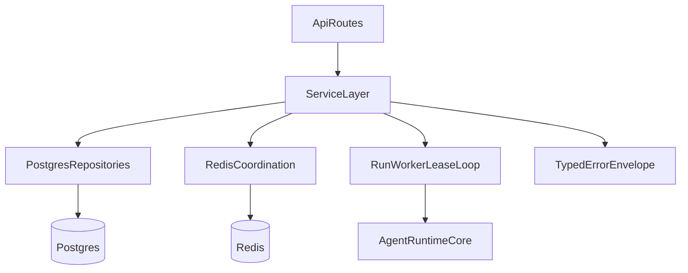

# Phase 2 Implementation Plan

## Goal
Deliver the next roadmap phase from docs: move canonical runtime/API state from in-memory structures to Postgres, add Redis coordination for concurrency/quotas/cancellation, and prove behavior with real dependency integration tests.

## Current Baseline (Confirmed)
- Backend still uses in-memory state in [src/backend/state.py](d:/Projects/clawagent/src/backend/state.py) and direct route coupling in [src/backend/app.py](d:/Projects/clawagent/src/backend/app.py).
- Send-message idempotency is currently optional in [src/backend/models.py](d:/Projects/clawagent/src/backend/models.py), while Phase 2 requires it.
- Tests are Phase 1 oriented in [tests/test_backend_phase1.py](d:/Projects/clawagent/tests/test_backend_phase1.py); no real Postgres/Redis harness exists yet.
- Phase contract and acceptance criteria are defined in [docs/tasks/phase-2-persistence-concurrency.md](d:/Projects/clawagent/docs/tasks/phase-2-persistence-concurrency.md), [docs/database-schema.md](d:/Projects/clawagent/docs/database-schema.md), and [docs/architecture/backend-api.md](d:/Projects/clawagent/docs/architecture/backend-api.md).

## Execution Architecture

## Workstreams
- **W1 - Persistence foundation**
  - Add SQLAlchemy async engine/session setup and repository interfaces plus Postgres adapters for users/sessions/conversations/messages/runs/summaries/tool approvals/corpus metadata.
  - Introduce migration scaffolding (Alembic) and initial schema migration aligned to [docs/database-schema.md](d:/Projects/clawagent/docs/database-schema.md).

- **W2 - API/service refactor**
  - Replace direct `BackendState` route calls in [src/backend/app.py](d:/Projects/clawagent/src/backend/app.py) with injected service/repository dependencies.
  - Make send-message require idempotency key at API boundary (remove optional fallback behavior from Phase 1).
  - Keep typed error envelope behavior stable while mapping DB/lock/rate-limit failures to documented error codes.

- **W3 - Redis coordination**
  - Implement conversation lock provider (`SET NX PX` + unique value release + renewal).
  - Add fixed-window per-user request/day and token/day counters with typed `rate_limited` responses and `Retry-After` where practical.
  - Add cancellation flag storage compatible with existing and future run cancel endpoints.

- **W4 - Run worker and deadlines**
  - Add Postgres-backed run claiming with lease/heartbeat fields and deadline metadata default (15 minutes configurable).
  - Ensure single-flight conversation semantics survive multi-process contention and lock-loss edge cases.

- **W5 - Test and verification gates**
  - Add real Postgres/Redis integration test harness (Docker Compose or Testcontainers).
  - Add required tests for ordering, duplicate idempotency, lock safety/renewal/loss, lease recovery, quotas, ownership, approvals, corpus metadata transactional switch, and summary immutability.
  - Keep/adjust Phase 1 API tests so auth/ownership behavior stays intact under Postgres-backed state.

## Documentation + Tracking Updates During Execution
- Set Phase 2 to **IN PROGRESS** in [docs/master-build-plan.md](d:/Projects/clawagent/docs/master-build-plan.md) at implementation start; mark **DONE (date)** on completion.
- Update [docs/database-schema.txt](d:/Projects/clawagent/docs/database-schema.txt) alongside schema changes required by this phase.
- Append [docs/decisions/log.md](d:/Projects/clawagent/docs/decisions/log.md) only if implementation introduces materially new architecture or policy decisions.
- Add implementation notes/status to [docs/tasks/phase-2-persistence-concurrency.md](d:/Projects/clawagent/docs/tasks/phase-2-persistence-concurrency.md).

## Definition of Done
- Postgres is canonical for conversation/run/session and required approval/corpus metadata state.
- Redis enforces per-conversation single-flight and per-user quota constraints.
- Send-message idempotency is required and enforced by API + DB constraints.
- Integration tests pass against at least one real Postgres/Redis path for ordering, locking, and lease recovery.
- CLI/API observable behavior for auth/ownership and typed errors remains stable.