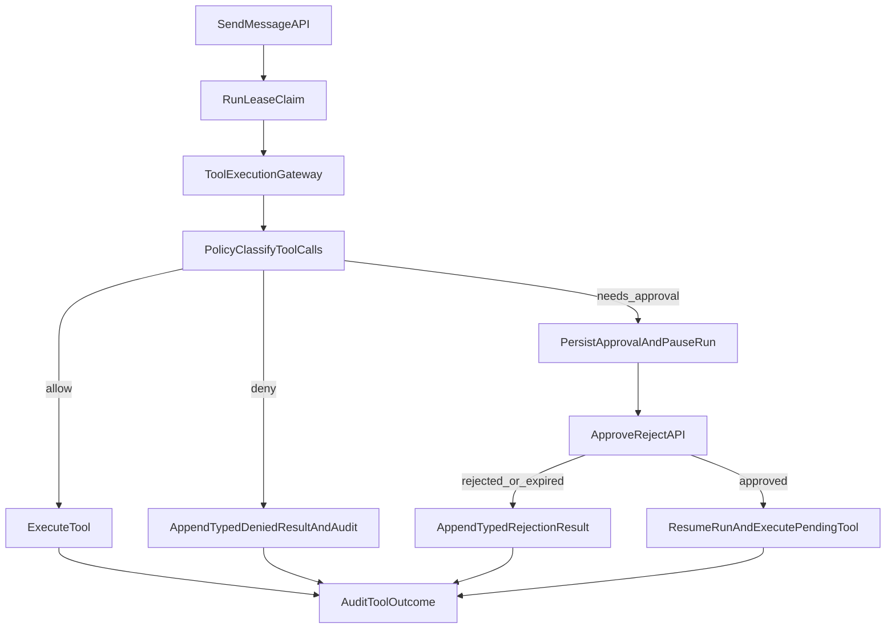

# Phase 4 Tool Safety Execution Plan

## Goal
Deliver `Phase 4 - Tool safety` from planned to done with contract-faithful behavior: global policy outcomes, approval-gated side effects, typed denials/rejections, workspace boundary enforcement, audit coverage, and CLI approval workflows.

## Current Baseline (What Exists)
- Phase tracker identifies Phase 4 as next planned item in [docs/master-build-plan.md](docs/master-build-plan.md).
- Durable approval/audit tables and repository adapters already exist in [src/backend/persistence/models.py](src/backend/persistence/models.py) and [src/backend/persistence/repositories.py](src/backend/persistence/repositories.py), but they are not yet integrated into runtime tool execution flow.
- Tool execution currently bypasses policy and approvals via direct registry execution in [src/agent/tools/registry.py](src/agent/tools/registry.py) and [src/agent/core/agent.py](src/agent/core/agent.py).
- API has no approval endpoints yet despite architecture contracts in [docs/architecture/backend-api.md](docs/architecture/backend-api.md).

## Implementation Streams

### 1) Introduce backend tool policy gateway and typed decisions
- Add a dedicated policy module under `src/backend/` (e.g., `tool_policy.py` + `tool_gateway.py`) that:
  - Classifies each call into `read_safe`, `write_project`, `shell`, `external_write`, `admin_global`, `publish`.
  - Returns `allow`, `deny`, or `needs_approval` before any side effect.
  - Resolves/normalizes file paths against configured workspace root; blocks traversal/out-of-root/symlink escape behavior.
- Use backend settings for policy toggles (keep `bash` denied by default).
- Standardize typed denial payloads to map cleanly to API error envelope (`tool_denied`) and model-visible tool results where needed.

### 2) Wire gateway into run/tool execution lifecycle
- Add run-worker execution path (Phase 2 queue + lease model) so tool calls are mediated through backend, not direct local-only execution.
- Integrate `ToolRegistry.execute_tool(...)` calls behind policy decision boundary.
- For multi-tool turns: classify all calls first; allow safe reads; pause side-effect sequence when an approval-required call is pending.

### 3) Implement durable approval pause/resume semantics
- On `needs_approval`:
  - Persist approval request via repository.
  - Mark run `paused` durably.
  - Emit/record approval-required event metadata.
- Add approval decision APIs in [src/backend/app.py](src/backend/app.py):
  - `GET /v1/runs/{run_id}/approvals`
  - `POST /v1/runs/{run_id}/approvals/{approval_id}/approve`
  - `POST /v1/runs/{run_id}/approvals/{approval_id}/reject`
- Enforce authority rules:
  - Conversation owner can approve their own risky conversation-scoped calls.
  - Admin required for `admin_global` and `publish`.
- Resume behavior:
  - Approved: continue pending side effect.
  - Rejected/expired: append typed model-visible tool result (`approval_rejected`/`approval_expired`) with no side effect execution.

### 4) Add approval expiry and audit lifecycle completeness
- Extend maintenance loop to auto-expire pending approvals using TTL.
- Audit all lifecycle events through `ToolAuditRepository`: allowed, denied, approval requested, approved/rejected/expired execution result.
- Ensure redacted preview + hashes are used, never raw file contents/secrets/prompts/responses.

### 5) Add CLI approval workflow support
- Extend [src/cli/main.py](src/cli/main.py) and [src/cli/api_client.py](src/cli/api_client.py):
  - Approval queue commands (`approvals list`, `approvals approve`, `approvals reject` or equivalent under `runs`).
  - Noninteractive mode prints `run_id`/`approval_id` guidance and never blocks.
  - Interactive streaming path surfaces inline approval prompts when feasible.
- Preserve `--output json` parity for automation/CI validation.

### 6) Tests and verification gates
- Add/extend tests under `tests/` to cover Phase 4 required matrix:
  - Path traversal/out-of-root denial.
  - Workspace read allowed.
  - Writes/edits approval-required by default.
  - Delete denied.
  - `bash` denied by default.
  - Approval pending pauses run, approve resumes, reject/expire yields typed model-visible result.
  - Owner/admin authorization boundaries for approval decisions.
  - Audit event creation and redaction constraints.
  - CLI queue commands for list/approve/reject.
- Run targeted test subsets first, then full affected suite.

## Sequence and Milestones
1. **Scaffold policy + gateway + typed errors** (no behavior regressions yet).
2. **Hook into execution path + run pause state transitions**.
3. **Expose approval endpoints + authority checks**.
4. **Add maintenance expiry + audit completeness**.
5. **CLI queue/inline UX + JSON output updates**.
6. **Complete test matrix + close docs/task tracker updates**.

## Documentation Updates Required In Same Workstream
- Set Phase 4 to `IN PROGRESS` then `DONE (date)` in [docs/master-build-plan.md](docs/master-build-plan.md).
- Update task notes/details in [docs/tasks/phase-4-tool-safety.md](docs/tasks/phase-4-tool-safety.md) as implementation lands.
- If policy or authority behavior deviates from current architecture contract, append a decision in [docs/decisions/log.md](docs/decisions/log.md).
- If schema changes are needed for approvals/audits, update both [docs/database-schema.md](docs/database-schema.md) and [docs/database-schema.txt](docs/database-schema.txt).

## Execution Flow (Target)

## Key Files to Touch First
- [src/backend/app.py](src/backend/app.py)
- [src/backend/services.py](src/backend/services.py)
- [src/backend/persistence/repositories.py](src/backend/persistence/repositories.py)
- [src/agent/core/agent.py](src/agent/core/agent.py)
- [src/agent/tools/registry.py](src/agent/tools/registry.py)
- [src/cli/main.py](src/cli/main.py)
- [src/cli/api_client.py](src/cli/api_client.py)
- [docs/tasks/phase-4-tool-safety.md](docs/tasks/phase-4-tool-safety.md)
- [docs/master-build-plan.md](docs/master-build-plan.md)