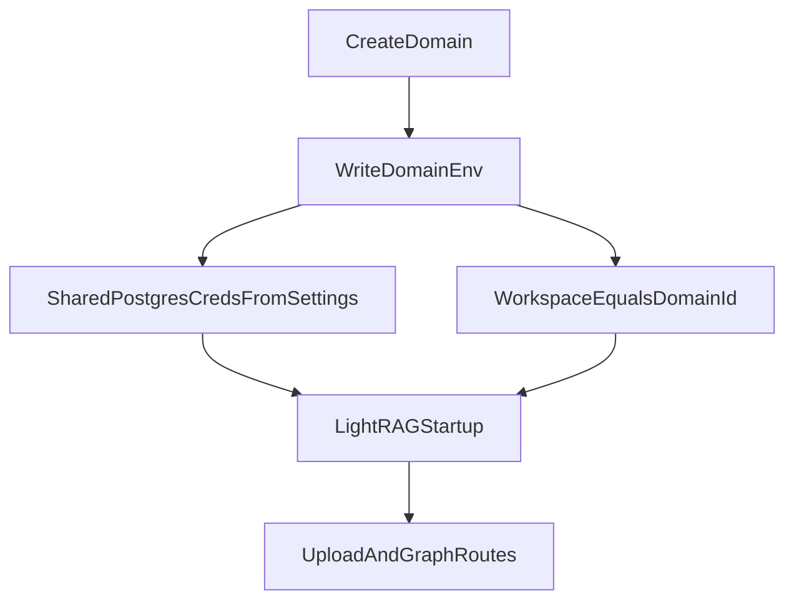

# Lean Postgres Auth Mismatch Fix

## Goal
Unblock LightRAG domain startup with the **smallest safe change** by stopping generation of unprovisioned per-domain Postgres credentials and using shared known-good credentials from the app runtime database URL.

## Root Cause Confirmed
- Domain creation currently writes per-domain values into generated `domain.env`:
  - `POSTGRES_DATABASE=lightrag_<domain>`
  - `POSTGRES_USER=lightrag_<domain>`
- No role/database provisioning exists in deploy service before container startup.
- LightRAG container then fails startup with password auth errors for non-existent users.

Relevant code:
- [`app/lightrag_deploy/service.py`](/data/home/tkodippili/Desktop/localTest_context_engine/app/lightrag_deploy/service.py)
- [`app/lightrag_deploy/compose.py`](/data/home/tkodippili/Desktop/localTest_context_engine/app/lightrag_deploy/compose.py)

## Minimal Change Strategy
1. Keep manifest/domain metadata shape stable for compatibility.
2. Change only generated `domain.env` Postgres runtime credentials to shared values derived from app database settings.
3. Preserve domain isolation via `WORKSPACE=<domain_id>` (already emitted) instead of DB/user-per-domain.

## Implementation Steps
1. **Impact preflight (GitNexus) before symbol edits**
   - Run impact on `render_domain_env` in [`app/lightrag_deploy/compose.py`](/data/home/tkodippili/Desktop/localTest_context_engine/app/lightrag_deploy/compose.py).
   - If risk is HIGH/CRITICAL, pause.

2. **Introduce shared runtime Postgres fields in deploy settings**
   - In [`app/lightrag_deploy/settings.py`](/data/home/tkodippili/Desktop/localTest_context_engine/app/lightrag_deploy/settings.py), add derived fields for runtime connection values used by generated domain env (database/user/password).
   - Populate from app settings database URL (and existing deploy password fallback) in `from_app_settings`.

3. **Use shared runtime credentials in generated domain.env**
   - In [`app/lightrag_deploy/compose.py`](/data/home/tkodippili/Desktop/localTest_context_engine/app/lightrag_deploy/compose.py), update `render_domain_env` so `POSTGRES_DATABASE`/`POSTGRES_USER`/`POSTGRES_PASSWORD` come from shared runtime values rather than `domain.postgres_*`.
   - Keep `WORKSPACE=<domain_id>` unchanged for logical isolation.

4. **Update focused tests**
   - Adjust assertions in [`tests/test_lightrag_deploy_service.py`](/data/home/tkodippili/Desktop/localTest_context_engine/tests/test_lightrag_deploy_service.py) that currently expect per-domain DB/user in `domain.env`.
   - Add/adjust test coverage for shared credential rendering and ensure manifest still excludes secrets.

5. **Docs contract touch-up (minimal)**
   - Update one targeted section in [`docs/deployment.md`](/data/home/tkodippili/Desktop/localTest_context_engine/docs/deployment.md) so it no longer claims per-domain DB/user ownership as current runtime behavior.

6. **Verify end-to-end**
   - Run targeted deploy tests.
   - Re-run manual checklist gates:
     - create domain
     - up domain
     - upload
     - graph endpoints
   - Confirm prior auth mismatch no longer appears in LightRAG logs.

## Data Flow After Fix

## Files to Change
- [`app/lightrag_deploy/settings.py`](/data/home/tkodippili/Desktop/localTest_context_engine/app/lightrag_deploy/settings.py)
- [`app/lightrag_deploy/compose.py`](/data/home/tkodippili/Desktop/localTest_context_engine/app/lightrag_deploy/compose.py)
- [`tests/test_lightrag_deploy_service.py`](/data/home/tkodippili/Desktop/localTest_context_engine/tests/test_lightrag_deploy_service.py)
- [`docs/deployment.md`](/data/home/tkodippili/Desktop/localTest_context_engine/docs/deployment.md)

## Acceptance Criteria
- `domain up` no longer fails with Postgres auth errors for `lightrag_<domain>` users.
- Upload succeeds for the new domain.
- Graph endpoints no longer fail due to LightRAG startup/auth mismatch.
- Targeted tests pass with updated credential contract.