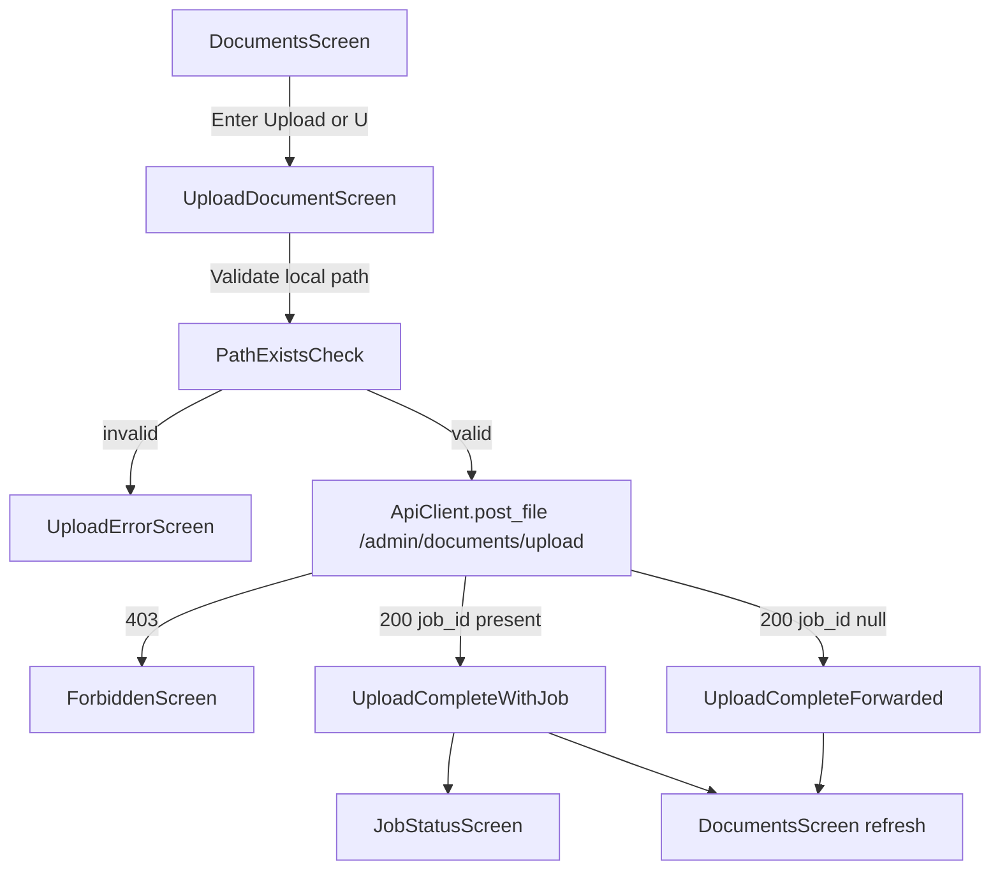

# RAGCLI TUI Upload UX Fix Implementation Plan

## Scope and Outcome
Implement all 9 slices from `ui_ux_fix.md` against the active TUI stack so users can upload documents end-to-end inside `ragcli ui` (empty-state actions, upload form, success/error/forbidden handling, and screen-clearing behavior), with test-first vertical slices.

## Source of Truth
- Brainstorm/spec: [d:/Projects/context_engine/docs/cli_docs/05_ragcli_tui_ux_fix/ui_ux_fix.md](d:/Projects/context_engine/docs/cli_docs/05_ragcli_tui_ux_fix/ui_ux_fix.md)
- TDD method: [d:/Projects/context_engine/.cursor/skills/engineering/tdd/SKILL.md](d:/Projects/context_engine/.cursor/skills/engineering/tdd/SKILL.md)

## Implementation Targets
- TUI behavior and navigation: [d:/Projects/context_engine/cli/tui/screens/content.py](d:/Projects/context_engine/cli/tui/screens/content.py), [d:/Projects/context_engine/cli/tui/navigation.py](d:/Projects/context_engine/cli/tui/navigation.py), [d:/Projects/context_engine/cli/tui/keys.py](d:/Projects/context_engine/cli/tui/keys.py)
- Existing screen builders to reuse/adapt: [d:/Projects/context_engine/cli/screens/documents.py](d:/Projects/context_engine/cli/screens/documents.py), [d:/Projects/context_engine/cli/screens/admin_documents.py](d:/Projects/context_engine/cli/screens/admin_documents.py)
- API contract reuse: [d:/Projects/context_engine/cli/api_client.py](d:/Projects/context_engine/cli/api_client.py), [d:/Projects/context_engine/cli/flows/upload_document.py](d:/Projects/context_engine/cli/flows/upload_document.py)
- TUI regression and new behavior tests: [d:/Projects/context_engine/tests/test_cli_tui.py](d:/Projects/context_engine/tests/test_cli_tui.py)

## Execution Strategy (TDD Vertical Slices)
For each slice: write one failing test -> implement minimum code to pass -> run focused tests -> refactor safely.

1. Empty docs screen menu (Upload/Refresh/Back/Quit), hide `Enter Open`, remove duplicate empty text.
2. Selecting `Upload document` opens upload form screen with editable file path.
3. Invalid local path shows upload error screen and skips backend call.
4. Valid path submits multipart `POST /admin/documents/upload` via existing client contract.
5. Success with `job_id` shows completion state with `View job status` option.
6. Success without `job_id` handles LightRAG-forwarded case without crash and with correct actions.
7. Backend `403` renders explicit forbidden screen from upload flow.
8. Non-empty documents screen adds `U` shortcut while preserving open-detail behavior.
9. Ensure render loop clears/replaces content between screen transitions (no stale appended output in TUI test path).

## Data and Control Flow

## Design Constraints to Enforce
- Keep authorization decisions backend-driven (no local admin inference).
- Reuse existing upload endpoint contract and multipart field (`file`).
- Keep rendering ASCII/simple monochrome and avoid leaking secrets.
- Preserve existing navigation keys (`B`, `Q`, `Ctrl+R`) while adding `U` for upload shortcut.

## Verification Plan
- Add/extend focused tests in `tests/test_cli_tui.py` for all 9 slices.
- Run targeted test module first, then broader CLI tests if needed for regressions.
- Validate no new lint issues in touched files.
- Manually sanity-check navigation transitions in `ragcli ui` if test harness cannot fully emulate terminal redraw behavior.

## Risks and Mitigations
- Existing shared screen builders may still emit CLI-style command hints; mitigate by handling TUI-specific empty-state rendering in `DocumentsScreen` where needed.
- LightRAG metadata shape may differ from previous assumptions; mitigate by reading nested `document.metadata.lightrag` defensively.
- Existing dirty working tree can mask regressions; mitigate by only touching scoped files and validating tests around modified behavior.