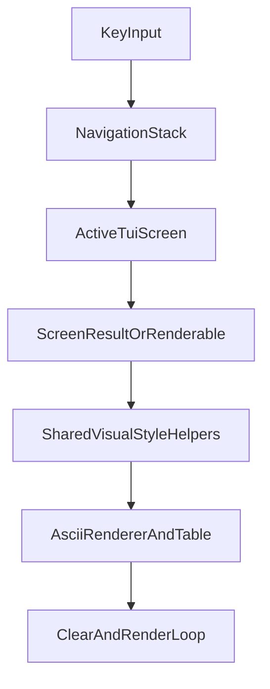

# Implement ragcli TUI visualization targets (strict-global)

## Goal
Bring `ragcli ui` in line with `docs/cli_docs/06_ragcli_tui_visual_screen_targets` across all documented screens (including extras), with strict-global breadcrumb + compact-footer rules, while preserving command-mode JSON behavior.

## Key files to change
- CLI/TUI rendering and shared style helpers:
  - [d:/Projects/context_engine/cli/tui/app.py](d:/Projects/context_engine/cli/tui/app.py)
  - [d:/Projects/context_engine/cli/tui/screens/content.py](d:/Projects/context_engine/cli/tui/screens/content.py)
  - [d:/Projects/context_engine/cli/tui/screens/login.py](d:/Projects/context_engine/cli/tui/screens/login.py)
  - [d:/Projects/context_engine/cli/tui/screens/main_menu.py](d:/Projects/context_engine/cli/tui/screens/main_menu.py)
  - [d:/Projects/context_engine/cli/tui/styles.py](d:/Projects/context_engine/cli/tui/styles.py)
  - [d:/Projects/context_engine/cli/renderers/base.py](d:/Projects/context_engine/cli/renderers/base.py)
  - [d:/Projects/context_engine/cli/renderers/tables.py](d:/Projects/context_engine/cli/renderers/tables.py)
- Screen-result builders likely needing semantic state and action metadata cleanup:
  - [d:/Projects/context_engine/cli/screens/admin_documents.py](d:/Projects/context_engine/cli/screens/admin_documents.py)
  - [d:/Projects/context_engine/cli/screens/documents.py](d:/Projects/context_engine/cli/screens/documents.py)
  - [d:/Projects/context_engine/cli/screens/retrieval.py](d:/Projects/context_engine/cli/screens/retrieval.py)
  - [d:/Projects/context_engine/cli/screens/jobs.py](d:/Projects/context_engine/cli/screens/jobs.py)
  - [d:/Projects/context_engine/cli/screens/lightrag.py](d:/Projects/context_engine/cli/screens/lightrag.py)
  - [d:/Projects/context_engine/cli/screens/observability.py](d:/Projects/context_engine/cli/screens/observability.py)
- Tests:
  - [d:/Projects/context_engine/tests/test_cli_tui.py](d:/Projects/context_engine/tests/test_cli_tui.py)
  - [d:/Projects/context_engine/tests/test_cli.py](d:/Projects/context_engine/tests/test_cli.py)
  - [d:/Projects/context_engine/tests/test_cli_screen_renderers.py](d:/Projects/context_engine/tests/test_cli_screen_renderers.py)
  - [d:/Projects/context_engine/tests/test_cli_ascii_samples.py](d:/Projects/context_engine/tests/test_cli_ascii_samples.py)

## Architecture shape

## Implementation strategy (TDD tracer bullets)
1. Establish a single visual contract layer in TUI/renderers:
   - shared helpers for breadcrumb header, compact key footer, semantic state labels, ID truncation + full-ID detail rendering, and ASCII-only table output.
   - ensure full-screen clear-before-render loop for active screens and no stale startup/deploy text bleed.
2. Upload-flow vertical slices first (one failing test -> minimal fix -> pass):
   - success with job, success without job, truncated IDs, Show full IDs, default action selection, forbidden (403), connection error/retry, no crash when `job_id` missing/null.
3. Apply same contract to documents and retrieval screens:
   - empty/list/detail/retrieval input/context/answer/compare extras with strict breadcrumb + compact footer.
4. Apply to admin/jobs/lightrag/backend-gaps/observability/auth/loading/logout:
   - consistent semantic labels, key footer, recommended defaults, and backend-owned permission semantics.
5. Keep compatibility constraints:
   - do not leak secrets in output; preserve backend enforcement behavior; do not change non-TUI command JSON mode.
6. Golden/sample stabilization:
   - update/add deterministic ASCII expectations where needed and verify all target screen snapshots/expectations are stable.

## Acceptance criteria
- Every targeted TUI screen uses:
  - breadcrumb hierarchy,
  - compact `Key | Key | ...` footer,
  - semantic `[SUCCESS]/[WARN]/[ERROR]` labels,
  - ASCII table rendering,
  - consistent ID truncation with explicit full-ID access where relevant.
- `ragcli ui` does not show stale startup/deploy text within active screens.
- Upload success path handles missing `job_id` safely.
- Forbidden/admin/gap/error states reflect backend responses accurately.
- Existing command-mode JSON output behavior remains unchanged.
- Test suite passes with new/updated visual and navigation behavior tests.

## Notes on “all including extras” scope
- Include additional implied screens/flows where docs reference actions but don’t fully render targets (e.g., retrieval answer/compare follow-through, observability routes) while still enforcing strict-global visual rules.
- If an implied screen is absent in code, add the minimum screen implementation necessary and cover it with behavior-focused TDD tests.