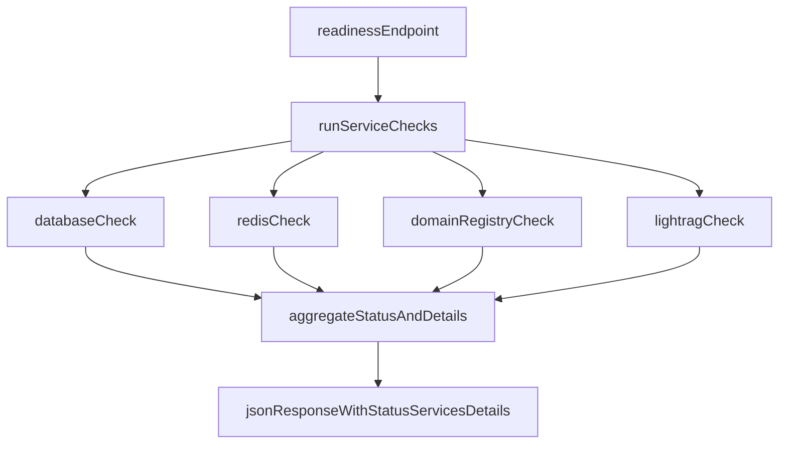

# Readiness Contract Hardening Plan

## Objective
Implement production-ready `GET /health/readiness` diagnostics for DB, Redis, LightRAG, and domain registry so the WebUI can render actionable errors, while keeping `GET /health` as lightweight liveness.

## Current Baseline (already present)
- [`/data/home/tkodippili/Desktop/localTest_context_engine/app/api/routes/health.py`](/data/home/tkodippili/Desktop/localTest_context_engine/app/api/routes/health.py) already routes readiness through `ReadinessService` and returns 503 when `status != "ready"`.
- [`/data/home/tkodippili/Desktop/localTest_context_engine/app/services/readiness_service.py`](/data/home/tkodippili/Desktop/localTest_context_engine/app/services/readiness_service.py) already probes DB, Redis (queue mode), default LightRAG health endpoint, and default domain registry entry.
- Existing contract tests are in [`/data/home/tkodippili/Desktop/localTest_context_engine/tests/test_api.py`](/data/home/tkodippili/Desktop/localTest_context_engine/tests/test_api.py), but diagnostics are limited to `healthy/unhealthy` strings.

## Target Contract
Keep the existing `status` and `services` map for compatibility, and add structured diagnostics for UI display in the chat page right-hand panel:
- `status`: `ready|not_ready`
- `services`: unchanged map of service -> `healthy|unhealthy`
- `details`: service -> `{ status, reason, latency_ms, checked_at }` (fields optional where unavailable)
- Stable service key order in responses: `database`, `redis`, `lightrag`, `domain_registry` (to reduce panel rendering churn)
- `reason` text must be short and user-facing (actionable, non-stacktrace)

Example (unhealthy redis):
- `services.redis = "unhealthy"`
- `details.redis.reason = "redis ping failed: ..."`

## TDD Implementation Strategy (vertical slices)
1. **Red:** Add an API test that expects `details` to be present on healthy readiness responses (without breaking existing `services` assertions).
2. **Green:** Extend `ReadinessReport` + `ReadinessService.check()` to populate diagnostic details per service while preserving current status logic.
3. **Red:** Add focused failing tests for each unhealthy path to assert reason propagation:
   - DB probe failure reason
   - Redis ping failure reason (queue mode)
   - Missing/invalid domain registry reason
   - LightRAG health failure reason (HTTP >= 400/timeout)
4. **Green:** Refactor probe helpers to return both health and reason metadata; centralize formatting so error text is stable for UI/tests.
5. **Refactor:** Keep `health()` unchanged (`{"status":"ok"}`) and ensure readiness payload shape remains backward-compatible for existing consumers.

## Files To Change
- [`/data/home/tkodippili/Desktop/localTest_context_engine/app/services/readiness_service.py`](/data/home/tkodippili/Desktop/localTest_context_engine/app/services/readiness_service.py)
  - Add structured per-service probe result model and reason capture.
- [`/data/home/tkodippili/Desktop/localTest_context_engine/app/api/routes/health.py`](/data/home/tkodippili/Desktop/localTest_context_engine/app/api/routes/health.py)
  - Return expanded readiness payload including `details`.
- [`/data/home/tkodippili/Desktop/localTest_context_engine/tests/test_api.py`](/data/home/tkodippili/Desktop/localTest_context_engine/tests/test_api.py)
  - Extend readiness tests to assert detailed diagnostics in healthy/unhealthy cases.
- [`/data/home/tkodippili/Desktop/localTest_context_engine/tests/test_cli_tui.py`](/data/home/tkodippili/Desktop/localTest_context_engine/tests/test_cli_tui.py)
  - Update readiness fixture/stub payloads if UI client assumptions require `services/details` presence.

## Readiness Flow

## Validation
- Run targeted readiness tests in [`/data/home/tkodippili/Desktop/localTest_context_engine/tests/test_api.py`](/data/home/tkodippili/Desktop/localTest_context_engine/tests/test_api.py).
- Run relevant CLI/TUI tests if updated (`tests/test_cli_services.py`, `tests/test_cli_tui.py`).
- Confirm unchanged liveness behavior at `/health`.
- Add contract assertions for stable service key set/order and non-empty `details.<service>.reason` when unhealthy.

## Notes
- This plan follows your requested TDD style (red-green-refactor) and prioritizes behavioral assertions over implementation coupling.
- No changes under `docs/brainstorm/`.