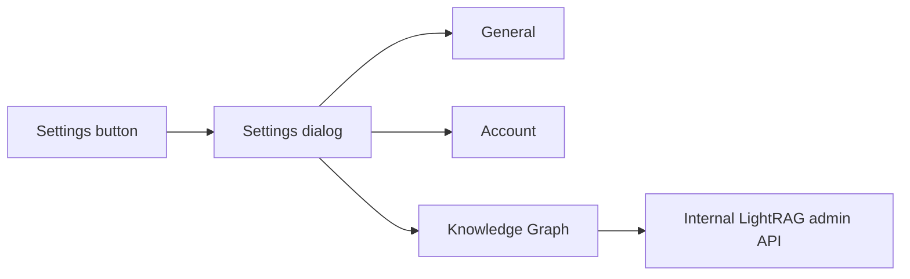

# Settings Modal With Knowledge Graph Panel

## Verified Current State
- The brainstorm plan is directionally valid, but parts are stale. Root env/port centralization already exists in [`/data/home/tkodippili/Desktop/localTest_context_engine/.env.example`](/data/home/tkodippili/Desktop/localTest_context_engine/.env.example) and [`/data/home/tkodippili/Desktop/localTest_context_engine/client/src/lib/api/client.ts`](/data/home/tkodippili/Desktop/localTest_context_engine/client/src/lib/api/client.ts), so this settings work should not re-open the old port-centralization phase.
- The current settings entry is a full-page link in [`/data/home/tkodippili/Desktop/localTest_context_engine/client/src/components/layout/AppPageFrame.tsx`](/data/home/tkodippili/Desktop/localTest_context_engine/client/src/components/layout/AppPageFrame.tsx) pointing to [`/data/home/tkodippili/Desktop/localTest_context_engine/client/src/app/settings/users/page.tsx`](/data/home/tkodippili/Desktop/localTest_context_engine/client/src/app/settings/users/page.tsx), not a modal.
- The client Account page calls [`/data/home/tkodippili/Desktop/localTest_context_engine/client/src/lib/api/users.ts`](/data/home/tkodippili/Desktop/localTest_context_engine/client/src/lib/api/users.ts), but backend `admin/users` routes are not currently registered. The database `users` table also has no `can_write`, `has_password`, or `last_login_at`, so the implementation should simplify Account to roles only.
- LightRAG lifecycle APIs already exist in [`/data/home/tkodippili/Desktop/localTest_context_engine/app/api/routes/lightrag_admin.py`](/data/home/tkodippili/Desktop/localTest_context_engine/app/api/routes/lightrag_admin.py). The public client label should become **Knowledge Graph**, while backend route names and service names stay `lightrag` to avoid high-churn renames.
- The old plan’s config mismatch item is resolved in current code: [`/data/home/tkodippili/Desktop/localTest_context_engine/app/lightrag_deploy/settings.py`](/data/home/tkodippili/Desktop/localTest_context_engine/app/lightrag_deploy/settings.py) reads `settings.lightrag_domain_registry`, and examples use `LIGHTRAG_DOMAIN_REGISTRY`.
- The old plan’s persistence warning is still valid: [`/data/home/tkodippili/Desktop/localTest_context_engine/docker-compose.yml`](/data/home/tkodippili/Desktop/localTest_context_engine/docker-compose.yml) persists uploads but not `.data/lightrag` for `api`, `worker`, or `status-poller`.
- GitNexus impact checks on planned touch points are LOW risk: `AppPageFrame` has 3 direct consumers, `SettingsUsersPage` has no upstream consumers, `LightRagChatShell` has 1 direct consumer, `create_app` affects `app.main` plus API tests, and `LightRAGDomainService` is imported by admin routes and tests.

## Target UX
- Build one modal settings shell in the client, using existing Radix dialog primitives from [`/data/home/tkodippili/Desktop/localTest_context_engine/client/src/components/ui/dialog.tsx`](/data/home/tkodippili/Desktop/localTest_context_engine/client/src/components/ui/dialog.tsx).
- Match the attached Settings image structurally: centered rounded dialog, close button top-left, left nav, right content pane, subtle borders, scrollable content, compact row-based settings.
- Ship only these tabs for now:
  - `General`: lightweight local UI preferences and current user summary; no fake security/observability cards.
  - `Account`: admin-only role-based user management. No write-access toggle.
  - `Knowledge Graph`: lifecycle management for LightRAG domains, but all visible copy says “Knowledge Graph” or “knowledge base/domain” instead of “LightRAG”.
- Do not expose Documents, Observability, Storage, or Security tabs yet.

## Implementation Approach
- Add a small settings feature folder under [`/data/home/tkodippili/Desktop/localTest_context_engine/client/src/components/settings`](/data/home/tkodippili/Desktop/localTest_context_engine/client/src/components/settings) with `SettingsDialog`, `GeneralSettingsPanel`, `AccountSettingsPanel`, and `KnowledgeGraphSettingsPanel`.
- Replace the settings sidebar link in [`/data/home/tkodippili/Desktop/localTest_context_engine/client/src/components/layout/AppPageFrame.tsx`](/data/home/tkodippili/Desktop/localTest_context_engine/client/src/components/layout/AppPageFrame.tsx) with a button that opens `SettingsDialog`; keep the existing `/settings/users` page as a fallback by rendering the same Account panel or redirecting to `/chat` with a settings query param.
- Extract the reusable Account behavior from [`/data/home/tkodippili/Desktop/localTest_context_engine/client/src/app/settings/users/page.tsx`](/data/home/tkodippili/Desktop/localTest_context_engine/client/src/app/settings/users/page.tsx), removing `can_write`, `pending-count`, and `mark-visited` calls to keep backend/API shape small.
- Add minimal backend admin-user routes in a new route module, registered from [`/data/home/tkodippili/Desktop/localTest_context_engine/app/main.py`](/data/home/tkodippili/Desktop/localTest_context_engine/app/main.py): list users, create user, update role, reset password, delete user. Reuse [`/data/home/tkodippili/Desktop/localTest_context_engine/app/storage/repositories/users.py`](/data/home/tkodippili/Desktop/localTest_context_engine/app/storage/repositories/users.py) and avoid schema migrations unless a required behavior cannot be expressed with the existing `users` columns.
- Add a typed client API for Knowledge Graph admin operations, wrapping existing `/admin/lightrag/domains` endpoints from [`/data/home/tkodippili/Desktop/localTest_context_engine/app/api/routes/lightrag_admin.py`](/data/home/tkodippili/Desktop/localTest_context_engine/app/api/routes/lightrag_admin.py).
- Keep internal symbols/routes as `LightRAG` where they represent the backend runtime. Change visible labels in chat, retrieval settings, login alt text, errors, and the new settings panel to `Knowledge Graph` where user-facing.
- Persist `.data/lightrag` in [`/data/home/tkodippili/Desktop/localTest_context_engine/docker-compose.yml`](/data/home/tkodippili/Desktop/localTest_context_engine/docker-compose.yml) for services that read/write lifecycle manifests.

## TDD / Validation
- Use vertical slices:
  - First backend API test: admin can list/create/update-role/reset/delete users through public HTTP endpoints; non-admin gets 403.
  - First client slice: settings button opens the dialog and shows `General`, `Account`, `Knowledge Graph` tabs only.
  - Next client slice: Knowledge Graph panel lists domains and triggers one lifecycle action through the typed API.
  - Final copy slice: visible client strings no longer expose `LightRAG` in primary UX labels.
- Run focused backend tests: `pytest tests/test_api.py` plus LightRAG lifecycle tests already covering domain APIs.
- Run frontend validation: `npm --prefix client run lint` and, if no frontend test runner exists, add only lightweight tests if the project already accepts the required tooling; otherwise document manual verification for the modal UX.
- Before committing any implementation, run `gitnexus_detect_changes()` as required by repo guidance.