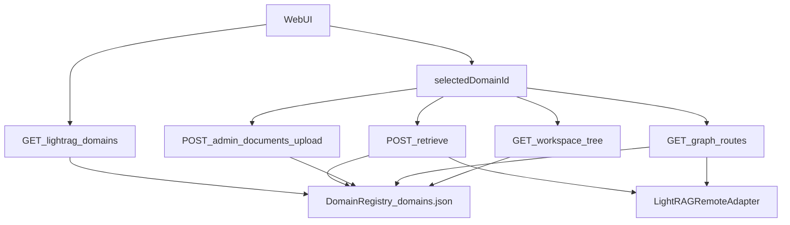

# Remove Dual Domain Behavior (Single Registry)

## Verified Current State
- Fallback exists in runtime domain resolution: [`/data/home/tkodippili/Desktop/localTest_context_engine/app/integrations/lightrag_domains.py`](/data/home/tkodippili/Desktop/localTest_context_engine/app/integrations/lightrag_domains.py) returns `settings.lightrag_base_url` when manifest entry is missing.
- Upload is strict-manifest: [`/data/home/tkodippili/Desktop/localTest_context_engine/app/services/document_service.py`](/data/home/tkodippili/Desktop/localTest_context_engine/app/services/document_service.py) requires a manifest file and rejects missing/invalid domains.
- Retrieve and graph paths do not enforce registry membership before adapter usage: [`/data/home/tkodippili/Desktop/localTest_context_engine/app/retrieval/lightrag_remote_engine.py`](/data/home/tkodippili/Desktop/localTest_context_engine/app/retrieval/lightrag_remote_engine.py), [`/data/home/tkodippili/Desktop/localTest_context_engine/app/api/routes/lightrag.py`](/data/home/tkodippili/Desktop/localTest_context_engine/app/api/routes/lightrag.py).
- Workspace tree is registry-backed through `LightRAGDomainService.get_domain`: [`/data/home/tkodippili/Desktop/localTest_context_engine/app/services/workspace_tree_service.py`](/data/home/tkodippili/Desktop/localTest_context_engine/app/services/workspace_tree_service.py).
- `/lightrag/domains` already returns a user-safe domain list from manifest-backed service: [`/data/home/tkodippili/Desktop/localTest_context_engine/app/api/routes/lightrag_admin.py`](/data/home/tkodippili/Desktop/localTest_context_engine/app/api/routes/lightrag_admin.py).
- Config currently supports dual runtime inputs (`lightrag_base_url`, `lightrag_domain`, `lightrag_domain_manifest`, `lightrag_domains_manifest`): [`/data/home/tkodippili/Desktop/localTest_context_engine/app/core/config.py`](/data/home/tkodippili/Desktop/localTest_context_engine/app/core/config.py).

## Decision To Implement
- Single mode only: **Registered LightRAG Domains**.
- The registry file is the single source of truth (current low-change path): `.data/lightrag/domains.json`.
- Every frontend-facing LightRAG operation requires explicit `lightrag_domain_id` and validates it through one registry service.
- Remove runtime fallback to `LIGHTRAG_BASE_URL` and `LIGHTRAG_DOMAIN` for request handling.

## Target Architecture
- Introduce `LightRAGDomainRegistry` (read/validate/runtime-lookup concern).
- Keep deployment operations in existing deploy service (or later split to `LightRAGDomainDeploymentService`) but ensure both write/read the same registry source.
- Route/service layers use only `LightRAGDomainRegistry` for domain existence + runtime connection resolution.

## Implementation Plan A (Junior Dev Friendly)

### Phase 1: Add a dedicated registry service
- Create [`/data/home/tkodippili/Desktop/localTest_context_engine/app/services/lightrag_domain_registry.py`](/data/home/tkodippili/Desktop/localTest_context_engine/app/services/lightrag_domain_registry.py) with methods:
  - `list_domains()`
  - `get_required(domain_id)`
  - `get_default()`
  - `validate_available(domain_id)`
- Back it by existing `DomainManifestStore` + `LightRAGDomainService` model reads to minimize risk.
- Add a small runtime DTO (`id`, `base_url`, `api_key`, `status`, `is_healthy`, `is_default`).

### Phase 2: Remove fallback resolution path
- Refactor [`/data/home/tkodippili/Desktop/localTest_context_engine/app/integrations/lightrag_domains.py`](/data/home/tkodippili/Desktop/localTest_context_engine/app/integrations/lightrag_domains.py):
  - stop returning `settings.lightrag_base_url` when domain missing.
  - perform registry lookup and raise typed domain-not-found/unavailable errors.
- Refactor [`/data/home/tkodippili/Desktop/localTest_context_engine/app/integrations/lightrag_remote_adapter.py`](/data/home/tkodippili/Desktop/localTest_context_engine/app/integrations/lightrag_remote_adapter.py) `for_domain()` to use registry resolution.

### Phase 3: Enforce required domain in request schemas/routes
- Make `RetrieveRequest.lightrag_domain_id` required in [`/data/home/tkodippili/Desktop/localTest_context_engine/app/schemas/retrieval.py`](/data/home/tkodippili/Desktop/localTest_context_engine/app/schemas/retrieval.py).
- Make upload form field required in [`/data/home/tkodippili/Desktop/localTest_context_engine/app/api/routes/admin.py`](/data/home/tkodippili/Desktop/localTest_context_engine/app/api/routes/admin.py).
- Remove hidden defaults in [`/data/home/tkodippili/Desktop/localTest_context_engine/app/services/document_service.py`](/data/home/tkodippili/Desktop/localTest_context_engine/app/services/document_service.py) and retrieval engine.

### Phase 4: Centralize validation in one place
- Replace manual manifest parsing in `DocumentService._validate_lightrag_domain` with registry calls.
- Validate graph route domain before proxy in [`/data/home/tkodippili/Desktop/localTest_context_engine/app/api/routes/lightrag.py`](/data/home/tkodippili/Desktop/localTest_context_engine/app/api/routes/lightrag.py).
- Ensure workspace tree continues to return 404 for unknown domains via same registry contract.

### Phase 5: Keep frontend API shape clean
- Ensure `/lightrag/domains` keeps user-safe fields only (`id`, `display_name`, `is_default`, `is_healthy`, `status`) in [`/data/home/tkodippili/Desktop/localTest_context_engine/app/api/routes/lightrag_admin.py`](/data/home/tkodippili/Desktop/localTest_context_engine/app/api/routes/lightrag_admin.py).

### Phase 6: Config cleanup
- In [`/data/home/tkodippili/Desktop/localTest_context_engine/app/core/config.py`](/data/home/tkodippili/Desktop/localTest_context_engine/app/core/config.py):
  - introduce canonical `LIGHTRAG_DOMAIN_REGISTRY` (or map to existing manifest field while deprecating duplicates).
  - deprecate runtime use of `LIGHTRAG_BASE_URL`, `LIGHTRAG_DOMAIN`, `LIGHTRAG_API_KEY` for route-time resolution.
  - keep `LIGHTRAG_TIMEOUT_SECONDS`.
- Update `.env` examples and docs accordingly.

### Phase 7: Test migration
- Update failing tests in [`/data/home/tkodippili/Desktop/localTest_context_engine/tests/test_api.py`](/data/home/tkodippili/Desktop/localTest_context_engine/tests/test_api.py) and add cases:
  - retrieve/upload return `400` when `lightrag_domain_id` is missing.
  - retrieve/graph return `404` or `400` when domain is not registered.
  - no fallback success path when manifest missing.
  - `/lightrag/domains` remains user-safe.

## Implementation Plan B (Coding Agent Workflow using `grill-me` + `tdd`)

### Track 1: `grill-me` decision hardening (pre-code)
- Validate and lock these decisions before edits:
  - error semantics (`400` vs `404`) for missing domain id vs unknown domain.
  - requiredness of `lightrag_domain_id` for upload/retrieve.
  - whether registry health gate should reject `status=stopped/unhealthy` for retrieve and graph.
  - canonical env variable name and deprecation messaging timeline.
- Output a short accepted contract checklist to prevent scope drift.

### Track 2: TDD tracer-bullet sequence (vertical slices)
- Slice 1 (RED->GREEN): retrieve requires `lightrag_domain_id`.
- Slice 2 (RED->GREEN): retrieve rejects unknown domain in registry.
- Slice 3 (RED->GREEN): graph routes reject unknown domain before proxy.
- Slice 4 (RED->GREEN): upload requires explicit domain id and validates via registry service only.
- Slice 5 (RED->GREEN): remove resolver fallback test expectations.
- Slice 6 (RED->GREEN): config validation enforces registry presence as runtime contract.

### Track 3: Refactor after green
- Extract reusable registry dependency provider for routes/services.
- Remove dead/default-domain branches.
- Keep deployment code path intact but isolated from request-time resolution.

### Track 4: Guardrail tests
- Add regression tests proving all entry points use one registry path.
- Ensure no route reaches `LightRAGRemoteAdapter.for_domain()` without prior registry validation.

## Suggested Deliverables Under Requested Brainstorm Path
- [`/data/home/tkodippili/Desktop/localTest_context_engine/.references/brainstorm/02_remove_two_domain_model_support/01_junior_dev_implementation_plan.md`](/data/home/tkodippili/Desktop/localTest_context_engine/.references/brainstorm/02_remove_two_domain_model_support/01_junior_dev_implementation_plan.md)
- [`/data/home/tkodippili/Desktop/localTest_context_engine/.references/brainstorm/02_remove_two_domain_model_support/02_agent_grill_me_tdd_plan.md`](/data/home/tkodippili/Desktop/localTest_context_engine/.references/brainstorm/02_remove_two_domain_model_support/02_agent_grill_me_tdd_plan.md)

(These files should be created in implementation mode immediately after plan approval.)