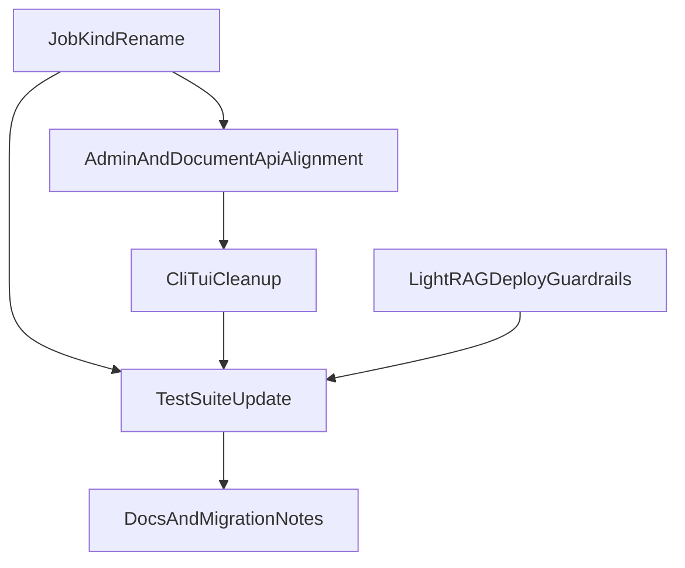

# Single Rich Nav Finalization With Deploy Preservation

## Locked Decisions
- Keep full in-app LightRAG deploy control plane (admin lifecycle APIs + CLI/TUI flows).
- Rename ingestion job kind from `lightrag_ingest_document` to `document_ingest`.

## Current State Snapshot
- Core runtime migration is mostly complete (rich pages/structure, retrieval wiring, TOC removal in app runtime).
- Remaining work is concentrated in naming consistency, CLI/TUI cleanup, and compatibility hardening while preserving deploy flows.

## Implementation Plan (TDD, vertical slices)
1. **Introduce job-kind alias + migration-safe rename path**
   - Add `document_ingest` as canonical kind and keep temporary compatibility for existing rows/clients.
   - Update enqueue/retry/worker dispatch first, then update API/CLI callers.
   - Primary files:
     - [/data/home/tkodippili/Desktop/localTest_context_engine/app/services/job_service.py](/data/home/tkodippili/Desktop/localTest_context_engine/app/services/job_service.py)
     - [/data/home/tkodippili/Desktop/localTest_context_engine/app/workers/tasks.py](/data/home/tkodippili/Desktop/localTest_context_engine/app/workers/tasks.py)
     - [/data/home/tkodippili/Desktop/localTest_context_engine/app/api/routes/jobs.py](/data/home/tkodippili/Desktop/localTest_context_engine/app/api/routes/jobs.py)

2. **Update document/admin API surfaces to the simplified contract**
   - Ensure upload/admin/reingest/status actions all use canonical `document_ingest` behavior and naming.
   - Remove stale request fields tied to old flow (including TOC-related request shape where still present).
   - Primary files:
     - [/data/home/tkodippili/Desktop/localTest_context_engine/app/api/routes/admin.py](/data/home/tkodippili/Desktop/localTest_context_engine/app/api/routes/admin.py)
     - [/data/home/tkodippili/Desktop/localTest_context_engine/app/services/document_service.py](/data/home/tkodippili/Desktop/localTest_context_engine/app/services/document_service.py)
     - [/data/home/tkodippili/Desktop/localTest_context_engine/app/schemas/documents.py](/data/home/tkodippili/Desktop/localTest_context_engine/app/schemas/documents.py)

3. **Clean CLI/TUI dead paths and align to current backend**
   - Remove/replace CLI/TUI actions still calling removed index/reindex/TOC-report endpoints.
   - Keep and validate all LightRAG domain lifecycle screens/services.
   - Primary files:
     - [/data/home/tkodippili/Desktop/localTest_context_engine/cli/services/admin_documents.py](/data/home/tkodippili/Desktop/localTest_context_engine/cli/services/admin_documents.py)
     - [/data/home/tkodippili/Desktop/localTest_context_engine/cli/services/documents.py](/data/home/tkodippili/Desktop/localTest_context_engine/cli/services/documents.py)
     - [/data/home/tkodippili/Desktop/localTest_context_engine/cli/tui/screens/content.py](/data/home/tkodippili/Desktop/localTest_context_engine/cli/tui/screens/content.py)
     - [/data/home/tkodippili/Desktop/localTest_context_engine/cli/screens/documents.py](/data/home/tkodippili/Desktop/localTest_context_engine/cli/screens/documents.py)

4. **Preserve and harden LightRAG domain deployment capability**
   - Keep `app/lightrag_deploy/*` and `app/api/routes/lightrag_admin.py` behavior intact.
   - Add/adjust tests to guard admin lifecycle endpoints and domain manifest/compose side effects against regressions introduced by other refactors.
   - Primary files:
     - [/data/home/tkodippili/Desktop/localTest_context_engine/app/api/routes/lightrag_admin.py](/data/home/tkodippili/Desktop/localTest_context_engine/app/api/routes/lightrag_admin.py)
     - [/data/home/tkodippili/Desktop/localTest_context_engine/app/lightrag_deploy/service.py](/data/home/tkodippili/Desktop/localTest_context_engine/app/lightrag_deploy/service.py)
     - [/data/home/tkodippili/Desktop/localTest_context_engine/tests/test_api.py](/data/home/tkodippili/Desktop/localTest_context_engine/tests/test_api.py)
     - [/data/home/tkodippili/Desktop/localTest_context_engine/tests/test_lightrag_deploy_service.py](/data/home/tkodippili/Desktop/localTest_context_engine/tests/test_lightrag_deploy_service.py)

5. **Finalize docs and migration notes**
   - Update stale brainstorm/status docs to reflect implemented rich-only runtime and the explicit deploy-control-plane decision.
   - Document `document_ingest` rename and compatibility window.
   - Primary files:
     - [/data/home/tkodippili/Desktop/localTest_context_engine/docs/brainstorm/10_context_engine_single_rich_navigation/00_current_state_summary.md](/data/home/tkodippili/Desktop/localTest_context_engine/docs/brainstorm/10_context_engine_single_rich_navigation/00_current_state_summary.md)
     - [/data/home/tkodippili/Desktop/localTest_context_engine/docs/implementation-status.md](/data/home/tkodippili/Desktop/localTest_context_engine/docs/implementation-status.md)

## TDD Execution Strategy
- For each slice, run strict RED -> GREEN -> REFACTOR loops on public behavior.
- Prioritized behavior tests:
  - Job enqueue/retry resolves to `document_ingest` and executes correct worker path.
  - Page/structure/retrieval endpoints remain rich-only.
  - CLI/TUI document actions no longer call removed endpoints.
  - LightRAG domain admin lifecycle endpoints still create/up/down/recreate/remove domains.

## Dependency Flow

## Validation Gates
- `pytest` targeted suites first, then full run.
- `ruff check .`
- `mypy .` if currently enforced in repo workflows.
- Verify no regressions in `/admin/lightrag/domains/*` lifecycle behavior and `/lightrag/domains` listing.