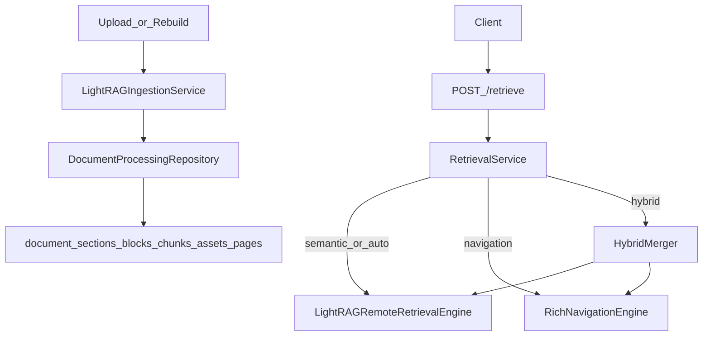

# Implement Single Rich Navigation End-to-End

## Confirmed Decisions
- Scope: implement all phases in one pass.
- Data migration: no backfill from `parsed_documents`; legacy docs must be re-ingested.
- Architecture target: LightRAG owns semantic retrieval; rich `DocumentStructure` owns deterministic navigation.

## Execution Sequence (TDD Vertical Slices)

### Slice 1: Persist pages in rich structure
- Add `DocumentPageRow` + migration for `document_pages` in:
  - [`/data/home/tkodippili/Desktop/localTest_context_engine/app/storage/tables.py`](/data/home/tkodippili/Desktop/localTest_context_engine/app/storage/tables.py)
  - [`/data/home/tkodippili/Desktop/localTest_context_engine/migrations/alembic/versions`](/data/home/tkodippili/Desktop/localTest_context_engine/migrations/alembic/versions)
- Extend repository page persistence and retrieval in:
  - [`/data/home/tkodippili/Desktop/localTest_context_engine/app/storage/repositories/document_processing.py`](/data/home/tkodippili/Desktop/localTest_context_engine/app/storage/repositories/document_processing.py)
- Red test first: update/create storage tests around `save_structure()`, `get_structure()`, `get_page()` in:
  - [`/data/home/tkodippili/Desktop/localTest_context_engine/tests/test_document_processing_storage.py`](/data/home/tkodippili/Desktop/localTest_context_engine/tests/test_document_processing_storage.py)

### Slice 2: Remove TOC refinement runtime path
- Remove TOC refinement wiring from ingestion flow in:
  - [`/data/home/tkodippili/Desktop/localTest_context_engine/app/services/lightrag_ingestion_service.py`](/data/home/tkodippili/Desktop/localTest_context_engine/app/services/lightrag_ingestion_service.py)
- Remove API/request controls and TOC report surface in:
  - [`/data/home/tkodippili/Desktop/localTest_context_engine/app/api/routes/admin.py`](/data/home/tkodippili/Desktop/localTest_context_engine/app/api/routes/admin.py)
  - [`/data/home/tkodippili/Desktop/localTest_context_engine/app/api/routes/documents.py`](/data/home/tkodippili/Desktop/localTest_context_engine/app/api/routes/documents.py)
  - [`/data/home/tkodippili/Desktop/localTest_context_engine/app/schemas/documents.py`](/data/home/tkodippili/Desktop/localTest_context_engine/app/schemas/documents.py)
- Red tests first in:
  - [`/data/home/tkodippili/Desktop/localTest_context_engine/tests/test_lightrag_ingestion_service.py`](/data/home/tkodippili/Desktop/localTest_context_engine/tests/test_lightrag_ingestion_service.py)
  - [`/data/home/tkodippili/Desktop/localTest_context_engine/tests/test_api.py`](/data/home/tkodippili/Desktop/localTest_context_engine/tests/test_api.py)

### Slice 3: Retarget page + structure APIs to rich source only
- Update page endpoint to `DocumentProcessingRepository.get_page()` and remove `parsed_documents` dependency.
- Update structure endpoint to rich-only response (no `navigation_indexes` fallback).
- Implement in:
  - [`/data/home/tkodippili/Desktop/localTest_context_engine/app/api/routes/documents.py`](/data/home/tkodippili/Desktop/localTest_context_engine/app/api/routes/documents.py)
  - [`/data/home/tkodippili/Desktop/localTest_context_engine/app/schemas/documents.py`](/data/home/tkodippili/Desktop/localTest_context_engine/app/schemas/documents.py)
- Red tests first in:
  - [`/data/home/tkodippili/Desktop/localTest_context_engine/tests/test_api.py`](/data/home/tkodippili/Desktop/localTest_context_engine/tests/test_api.py)

### Slice 4: Introduce RichNavigationEngine and wire retrieval
- Add `RichNavigationEngine` using `DocumentStructure` sections/blocks/source_chunks/pages/assets in:
  - [`/data/home/tkodippili/Desktop/localTest_context_engine/app/retrieval/rich_navigation_engine.py`](/data/home/tkodippili/Desktop/localTest_context_engine/app/retrieval/rich_navigation_engine.py)
- Wire retrieval service + strategies for `navigation` and `hybrid` to use rich engine in:
  - [`/data/home/tkodippili/Desktop/localTest_context_engine/app/services/retrieval_service.py`](/data/home/tkodippili/Desktop/localTest_context_engine/app/services/retrieval_service.py)
  - [`/data/home/tkodippili/Desktop/localTest_context_engine/app/retrieval/strategies.py`](/data/home/tkodippili/Desktop/localTest_context_engine/app/retrieval/strategies.py)
- Red tests first in:
  - [`/data/home/tkodippili/Desktop/localTest_context_engine/tests/test_api.py`](/data/home/tkodippili/Desktop/localTest_context_engine/tests/test_api.py)
  - Add targeted engine tests under [`/data/home/tkodippili/Desktop/localTest_context_engine/tests`](/data/home/tkodippili/Desktop/localTest_context_engine/tests)

### Slice 5: Remove old navigation layer and legacy tables
- Stop enqueueing legacy navigation processing jobs and remove old runtime consumers/writers in:
  - [`/data/home/tkodippili/Desktop/localTest_context_engine/app/services/document_service.py`](/data/home/tkodippili/Desktop/localTest_context_engine/app/services/document_service.py)
  - [`/data/home/tkodippili/Desktop/localTest_context_engine/app/services/job_service.py`](/data/home/tkodippili/Desktop/localTest_context_engine/app/services/job_service.py)
  - [`/data/home/tkodippili/Desktop/localTest_context_engine/app/workers/tasks.py`](/data/home/tkodippili/Desktop/localTest_context_engine/app/workers/tasks.py)
  - [`/data/home/tkodippili/Desktop/localTest_context_engine/app/services/indexing_service.py`](/data/home/tkodippili/Desktop/localTest_context_engine/app/services/indexing_service.py)
  - [`/data/home/tkodippili/Desktop/localTest_context_engine/app/indexing/navigation_index_builder.py`](/data/home/tkodippili/Desktop/localTest_context_engine/app/indexing/navigation_index_builder.py)
  - [`/data/home/tkodippili/Desktop/localTest_context_engine/app/retrieval/navigation_engine.py`](/data/home/tkodippili/Desktop/localTest_context_engine/app/retrieval/navigation_engine.py)
  - [`/data/home/tkodippili/Desktop/localTest_context_engine/app/integrations/pageindex_adapter.py`](/data/home/tkodippili/Desktop/localTest_context_engine/app/integrations/pageindex_adapter.py)
  - [`/data/home/tkodippili/Desktop/localTest_context_engine/app/storage/repositories/documents.py`](/data/home/tkodippili/Desktop/localTest_context_engine/app/storage/repositories/documents.py)
- Add migration to drop `parsed_documents`, `navigation_indexes` (and TOC report table if now unused) in:
  - [`/data/home/tkodippili/Desktop/localTest_context_engine/migrations/alembic/versions`](/data/home/tkodippili/Desktop/localTest_context_engine/migrations/alembic/versions)
- Red tests first in:
  - [`/data/home/tkodippili/Desktop/localTest_context_engine/tests/test_api.py`](/data/home/tkodippili/Desktop/localTest_context_engine/tests/test_api.py)
  - migration tests under [`/data/home/tkodippili/Desktop/localTest_context_engine/tests`](/data/home/tkodippili/Desktop/localTest_context_engine/tests)

## Architecture Flow Target

## Validation and Exit Criteria
- Run full test suite incrementally per slice, then complete run:
  - `pytest`
- Run static checks used in repo:
  - `ruff check .`
- Validate migration chain:
  - `alembic upgrade head`
- Confirm legacy symbols are removed:
  - `rg "get_parsed|save_parsed|ParsedDocumentRow|NavigationIndexRow|get_navigation_index|save_navigation_index|PageIndexAdapter|NavigationRetrievalEngine|NavigationIndexBuilder|TocRefiner|toc_refinement"`
- Manual API verification:
  - `GET /documents/{id}/structure` (rich only)
  - `GET /documents/{id}/pages/{n}` (from `document_pages`)
  - `POST /retrieve` for `navigation`, `semantic`, `hybrid`

## Risks and Mitigations
- Legacy documents without re-ingestion will not have rich pages/structure and should return not-found semantics; document this in API behavior notes.
- Retrieval ranking quality can shift when moving from token-overlap page index to rich navigation scoring; keep deterministic scoring + metadata assertions in tests.
- Large single-pass change can create broad regressions; enforce strict red-green-refactor loop per slice and keep each slice passing before proceeding.