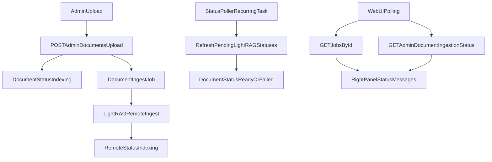

# Upload Ingestion And Readiness Hardening Plan

## Verified Issues
- Upload flow is partially complete, but automatic LightRAG indexing sync is not wired: `poll_lightrag_statuses()` exists without recurring execution in [`/data/home/tkodippili/Desktop/localTest_context_engine/app/workers/tasks.py`](/data/home/tkodippili/Desktop/localTest_context_engine/app/workers/tasks.py) and worker entrypoint only runs queue worker in [`/data/home/tkodippili/Desktop/localTest_context_engine/app/workers/worker.py`](/data/home/tkodippili/Desktop/localTest_context_engine/app/workers/worker.py).
- Current user-facing ingestion status path is blocked for non-ready docs and is awkward for admin upload UX in [`/data/home/tkodippili/Desktop/localTest_context_engine/app/api/routes/documents.py`](/data/home/tkodippili/Desktop/localTest_context_engine/app/api/routes/documents.py).
- Readiness is not production-grade: DB + conditional Redis are checked, but LightRAG check is only registry-file existence in [`/data/home/tkodippili/Desktop/localTest_context_engine/app/api/routes/health.py`](/data/home/tkodippili/Desktop/localTest_context_engine/app/api/routes/health.py).

## Scope (Chosen)
- Add recurring backend status sync plus a clean admin ingestion-status polling endpoint.
- Keep LightRAG `track_id` internal to backend workflow (not required by WebUI contract).
- Make readiness strict for default domain: fail readiness if DB/Redis fail, registry invalid/missing, or default LightRAG health probe fails.

## Design

## Implementation Workstreams
- **Workstream A: Admin-compatible ingestion polling contract**
  - Add admin endpoint in [`/data/home/tkodippili/Desktop/localTest_context_engine/app/api/routes/admin.py`](/data/home/tkodippili/Desktop/localTest_context_engine/app/api/routes/admin.py): `GET /admin/documents/{document_id}/ingestion-status`.
  - Reuse shared serializer for ingestion status payload (document status + structure flags + LightRAG status), but redact internal `track_id` from response payload.
  - Keep existing `POST /admin/documents/{document_id}/refresh-status` for manual override/debug, but stop requiring it for normal WebUI polling.

- **Workstream B: Recurring LightRAG status synchronization (lean scheduler)**
  - Add a lightweight recurring poller entrypoint that periodically executes `poll_lightrag_statuses()` from [`/data/home/tkodippili/Desktop/localTest_context_engine/app/workers/tasks.py`](/data/home/tkodippili/Desktop/localTest_context_engine/app/workers/tasks.py).
  - Wire poller process in compose/runtime so it starts with backend deployment.
  - Add poll interval config (sane default) in settings to tune load without code changes.

- **Workstream C: Strict readiness checks for default domain**
  - Refactor readiness checks into a small service module (testable), then call from route in [`/data/home/tkodippili/Desktop/localTest_context_engine/app/api/routes/health.py`](/data/home/tkodippili/Desktop/localTest_context_engine/app/api/routes/health.py).
  - Return consistent shape:
    - `status: ready | not_ready`
    - `services: { database, redis, lightrag, domain_registry }` using `healthy|unhealthy` values.
  - Validate registry parse + default domain presence + default domain `base_url` reachability (`/health`) with short timeout.
  - Preserve `/health` as lightweight liveness endpoint.

- **Workstream D: Tests (TDD vertical slices)**
  - Add/extend API tests in [`/data/home/tkodippili/Desktop/localTest_context_engine/tests/test_api.py`](/data/home/tkodippili/Desktop/localTest_context_engine/tests/test_api.py):
    - Admin ingestion-status polling during indexing.
    - Poller-driven transition indexing -> ready/failed.
    - Readiness success/failure matrix (DB fail, Redis fail when queue mode, invalid registry, default domain unhealthy).
  - Keep tests behavior-focused through public HTTP endpoints and worker task interfaces.

- **Workstream E: Documentation for junior dev and coding agent**
  - Create implementation docs under [`/data/home/tkodippili/Desktop/localTest_context_engine/.references/brainstorm/06_upload_ingestion_status_flow`](/data/home/tkodippili/Desktop/localTest_context_engine/.references/brainstorm/06_upload_ingestion_status_flow):
    - `01_junior_dev_implementation_plan.md` (stepwise execution order + gotchas).
    - `02_agent_grill_me_tdd_plan.md` (decision checkpoints, test-first slices, acceptance checklist).
  - Update API/deployment docs impacted by contract changes (health payload and admin ingestion polling endpoint).

## Acceptance Criteria
- Admin WebUI upload flow can rely on `POST /admin/documents/upload`, `GET /jobs/{job_id}`, and admin ingestion-status polling only (no frontend LightRAG `track_id` logic).
- Document status reaches terminal state without manual `refresh-status` under normal operation.
- Readiness endpoint reports dependency-specific health and returns `not_ready` when default-domain prerequisites fail.
- Tests cover new behavior and pass in CI.