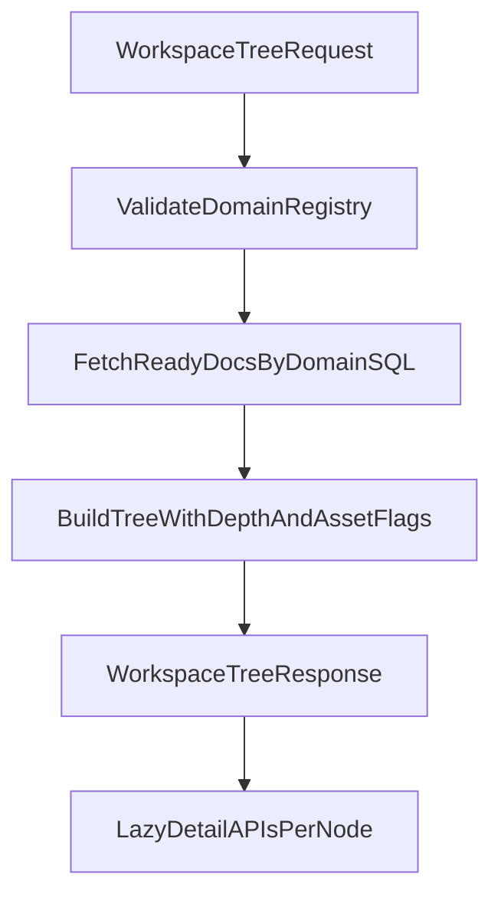

# Workspace Tree Stable Contract Plan

## Verified Baseline Against Codebase
- Current endpoint exists at [`/data/home/tkodippili/Desktop/localTest_context_engine/app/api/routes/workspace_tree.py`](/data/home/tkodippili/Desktop/localTest_context_engine/app/api/routes/workspace_tree.py) as `GET /lightrag/domains/{domain_id}/workspace-tree` with no query params.
- Node kinds are already constrained to `domain | document | section | page | chunk | asset` in [`/data/home/tkodippili/Desktop/localTest_context_engine/app/schemas/workspace_tree.py`](/data/home/tkodippili/Desktop/localTest_context_engine/app/schemas/workspace_tree.py).
- Leak safeguards are already present in [`/data/home/tkodippili/Desktop/localTest_context_engine/app/services/workspace_tree_service.py`](/data/home/tkodippili/Desktop/localTest_context_engine/app/services/workspace_tree_service.py): chunk titles are snippet-truncated and page `metadata.text` is stripped; API test coverage exists in [`/data/home/tkodippili/Desktop/localTest_context_engine/tests/test_api.py`](/data/home/tkodippili/Desktop/localTest_context_engine/tests/test_api.py).
- Performance concern is valid: [`list_ready_by_lightrag_domain()`](/data/home/tkodippili/Desktop/localTest_context_engine/app/storage/repositories/documents.py) currently runs `list_ready()` then Python metadata filtering.
- The “add later” document detail endpoints already exist: [`/data/home/tkodippili/Desktop/localTest_context_engine/app/api/routes/documents.py`](/data/home/tkodippili/Desktop/localTest_context_engine/app/api/routes/documents.py) implements `/structure`, `/sections/{section_id}`, `/pages/{page_number}`, `/chunks/{chunk_id}`.

## Design Decisions (Locked)
- Use **recommended-safe direction**: keep backward-compatible defaults for workspace-tree; frontend explicitly requests `?depth=2&include_assets=true`.
- Add query contract without breaking existing callers:
  - `depth`: optional positive integer; when omitted, return full tree as today.
  - `include_assets`: optional boolean; default `true` (current behavior).
- Define depth as **max node distance from root domain node** (root distance = 0).

## Implementation Plan
1. Add request controls on workspace-tree route.
   - Update [`/data/home/tkodippili/Desktop/localTest_context_engine/app/api/routes/workspace_tree.py`](/data/home/tkodippili/Desktop/localTest_context_engine/app/api/routes/workspace_tree.py) to accept `depth` and `include_assets` query params and pass to service.
2. Optimize domain document filtering in repository.
   - Refactor [`/data/home/tkodippili/Desktop/localTest_context_engine/app/storage/repositories/documents.py`](/data/home/tkodippili/Desktop/localTest_context_engine/app/storage/repositories/documents.py) so domain filtering happens in SQL JSON expressions (`domain_id` + legacy `domain`) instead of Python post-filtering.
3. Make tree assembly parameterized but safe.
   - Extend [`/data/home/tkodippili/Desktop/localTest_context_engine/app/services/workspace_tree_service.py`](/data/home/tkodippili/Desktop/localTest_context_engine/app/services/workspace_tree_service.py) to:
     - honor `depth` while preserving existing full-tree behavior when omitted,
     - honor `include_assets` by skipping asset-node creation when false,
     - keep current leak guards unchanged.
4. Lock and expand tests.
   - Extend workspace-tree tests in [`/data/home/tkodippili/Desktop/localTest_context_engine/tests/test_api.py`](/data/home/tkodippili/Desktop/localTest_context_engine/tests/test_api.py) for:
     - default backward-compatible behavior,
     - `depth=2` shape constraints,
     - `include_assets=false` exclusion,
     - continued non-leak assertions for page/chunk body text.
5. Publish design-plan artifacts requested.
   - Create:
     - [`/data/home/tkodippili/Desktop/localTest_context_engine/.references/brainstorm/03_workspace_tree_stable_contract/01_junior_dev_implementation_plan.md`](/data/home/tkodippili/Desktop/localTest_context_engine/.references/brainstorm/03_workspace_tree_stable_contract/01_junior_dev_implementation_plan.md)
     - [`/data/home/tkodippili/Desktop/localTest_context_engine/.references/brainstorm/03_workspace_tree_stable_contract/02_agent_grill_me_tdd_plan.md`](/data/home/tkodippili/Desktop/localTest_context_engine/.references/brainstorm/03_workspace_tree_stable_contract/02_agent_grill_me_tdd_plan.md)
   - Keep format aligned with existing brainstorming plan style and include RED/GREEN tracer bullets for grill-me + TDD execution.
6. Update API contract docs for frontend integration.
   - Add explicit workspace-tree query contract and lazy-detail call pattern to [`/data/home/tkodippili/Desktop/localTest_context_engine/docs/cli_docs/api-contract.md`](/data/home/tkodippili/Desktop/localTest_context_engine/docs/cli_docs/api-contract.md).

## Validation
- Run focused tests first:
  - `uv run pytest tests/test_api.py -k workspace_tree -q`
- Then run broader safety checks for related document surfaces:
  - `uv run pytest tests/test_api.py -k "structure or sections or pages or chunks" -q`
- Run lints on edited files and fix any new diagnostics before final handoff.