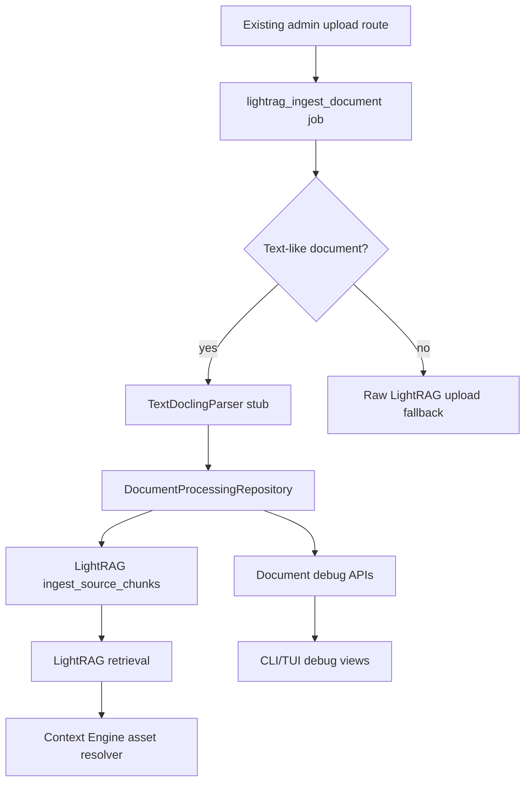

# 15 — Fresh Agent Handoff

This handoff summarizes the current implementation state for a fresh agent continuing the Docling + PageIndex TOC Refiner + LightRAG document-navigation work.

Use this together with:

- `CONTEXT.md`
- `docs/adr/0005-document-structure-and-assets-control-plane.md`
- `docs/implementation-status.md`
- `docs/brainstorm/lightrag_toc_refiner_image_aware_docs/13_incremental_implementation_plan.md`

Suggested skills for the next session:

- `tdd`
- `grill-with-docs`
- `handoff` when preparing the next context transfer

## What Was Implemented In The Recent Session

### Production-Wired Source Chunk Ingestion

The existing LightRAG upload/job path now has a first vertical document-processing slice:

- `LightRAGIngestionService.ingest_document()` attempts canonical structure ingestion for text-like files.
- `TextDoclingParser` builds a lightweight `DocumentStructure` with document-prefixed section/block/source-chunk IDs.
- `DocumentProcessingRepository.save_structure()` persists sections, blocks, source chunks, and assets.
- Source chunks are sent to LightRAG via `LightRAGRemoteAdapter.ingest_source_chunks()`.
- Unsupported/non-text files still fall back to the older raw `upload_document()` path.

Important files:

- `app/services/lightrag_ingestion_service.py`
- `app/document_processing/pipeline.py`
- `app/integrations/lightrag_remote_adapter.py`
- `app/storage/repositories/document_processing.py`
- `tests/test_lightrag_ingestion_service.py`

### Canonical Document Debug APIs

The existing document API now exposes canonical document-processing data when available:

- `GET /documents/{document_id}/structure`
- `GET /documents/{document_id}/structure-quality`
- `GET /documents/{document_id}/sections/{section_id}`
- `GET /documents/{document_id}/chunks/{chunk_id}`
- `GET /documents/{document_id}/toc-refinement-report`
- existing asset/thumbnail streaming remains under `/documents/{document_id}/assets/...`

These routes use the same ready-document access policy as the rest of the document API. Navigation-tree fallback is preserved for `/structure` when no canonical structure exists.

Important files:

- `app/api/routes/documents.py`
- `app/schemas/documents.py`
- `app/storage/repositories/document_processing.py`
- `tests/test_api.py`

### Retrieval Asset Resolution

Retrieval asset enrichment now supports the metadata shape emitted by chunk ingest:

- old shape: `metadata.source_chunk_id`
- new shape: `metadata.chunk_id`

LightRAG adapter query normalization preserves returned chunk metadata, including `chunk_id` and `asset_ids`.

Important files:

- `app/services/retrieval_asset_resolver.py`
- `app/integrations/lightrag_remote_adapter.py`
- `tests/test_retrieval_asset_enrichment.py`
- `tests/test_lightrag_remote_adapter.py`

### CLI/TUI Debug Surfaces

The CLI service layer and TUI/screen builders now expose the new document debug data:

- `DocumentService.get_structure_quality()`
- `DocumentService.get_section()`
- `DocumentService.get_chunk()`
- `DocumentService.get_toc_refinement_report()`
- document detail shows structure quality and TOC refinement report when available
- Enter from document detail opens the structure screen
- canonical structure summary includes source, section count, source chunk count, and asset count
- structure rows render canonical `page_start`/`page_end`
- section detail and source chunk detail have screen builders

Important files:

- `cli/services/documents.py`
- `cli/screens/documents.py`
- `cli/tui/screens/content.py`
- `tests/test_cli_services.py`
- `tests/test_cli_tui.py`
- `tests/test_cli_document_screens.py`

## Current Architecture Shape



## Important Constraints

- Keep using existing public upload/query routes. ADR 0005 rejects parallel upload/query routes for image-aware flows.
- Context Engine owns Document Structure, Source Chunks, Assets, debug APIs, and authenticated asset streaming.
- LightRAG owns semantic retrieval, embeddings, vector indexes, graph data, and ranking.
- Do not send image bytes or base64 to LightRAG.
- Do not add a local semantic fallback or duplicate embedding tables.
- Preserve raw LightRAG upload fallback until real Docling parsing exists for PDFs and other non-text inputs.

## Remaining Major Work

### 1. Harden Real Docling Parser And Assets

This is the recommended next substantial phase.

Already started:

- `DoclingParser`
- `DocumentStructureBuilder`
- `AssetExtractor`
- `ThumbnailGenerator`
- content-hash asset deduplication
- resized thumbnails when Pillow can read the extracted asset
- figure/image/table snapshot extraction when Docling exposes image data
- label normalization for headings, paragraphs, tables, figures/images, captions, lists, code, page headers/footers, and unknown blocks
- nested Docling section parent/child preservation

Still needed:

- real Docling PDF fixture hardening
- stronger figure/caption linking
- broader parser-output variation coverage

Expected output:

- canonical `DocumentStructure`
- asset files under document storage
- asset metadata rows
- thumbnails

Relevant docs:

- `04_ingestion_pipeline.md`
- `06_docling_asset_extraction.md`
- `10_storage_database_filesystem.md`

### 2. StructureAwareChunkBuilder Hardening

`StructureAwareChunkBuilder` now exists and is wired into ingestion. It:

- keep chunks inside section boundaries when possible
- split large sections
- preserve page ranges
- inherit `asset_ids` from blocks/assets
- generate globally unique chunk IDs
- record section title/path metadata and forward it to LightRAG
- prepend section path to chunk text and use asset captions for asset-only chunks

Remaining work is tuning chunk size and chunk text shape against real Docling output.

### 3. TOC Refiner And Merge

The TOC refiner is still an injectable/bounded scaffold rather than a real LLM prompt chain, but it now includes:

- `auto` / `always` / `never` ingestion modes
- bounded extractor call enforcement
- deterministic parsing for common TOC lines such as `Safety .... 4` and `1.2 Hydraulics .... 12`
- page offset resolution
- title-matched logical-to-physical page offset inference that skips TOC-like pages
- normalized title/page start validation before accepting refined sections
- hierarchy-aware section range assignment so parents span their children until the next same-or-higher-level section
- nested refined section parent/child preservation
- deepest matching block/asset assignment for overlapping section ranges

Still needed:

- real JSON-only LLM extractor provider
- robust TOC page text extraction from real PDFs
- broader validation/repair retries

Relevant docs:

- `03_canonical_models.md`
- `04_ingestion_pipeline.md`
- `12_testing_strategy.md`

### 4. Retrieval Assets And Debug Surfaces

Implemented:

- retrieval asset resolution from `metadata.source_chunk_id`, `metadata.chunk_id`, and returned `metadata.asset_ids`
- asset ranking by direct chunk metadata, block links, caption/query overlap, page proximity, and section proximity
- admin upload TOC mode, structure rebuild, and LightRAG reingest wrappers
- CLI/TUI chunk metadata display

Still needed:

- test against actual LightRAG response variants
- richer TUI asset drill-down/open-external behavior

### 5. PageIndex-Style TOC Refiner

Current `TocRefiner` is bounded scaffolding. Remaining services:

- `TocPageDetector`
- `TocJsonExtractor`
- `PageOffsetResolver`
- `SectionStartValidator`
- `SectionRangeAssigner`
- bounded/logged LLM calls
- report persistence

Relevant docs:

- `05_pageindex_toc_llm_refiner.md`
- `12_testing_strategy.md`

### 4. Merge And Assignment

Still needed:

- `StructureMerger`
- `BlockSectionAssigner`
- `AssetSectionAssigner`

Goal:

```text
refined sections + original Docling blocks/assets = final DocumentStructure
```

### 5. Hardening LightRAG Source Resolution

The current adapter preserves metadata and asset resolution can use `metadata.chunk_id`, but source resolution still needs more real-world testing against actual LightRAG responses.

Focus on:

- what LightRAG really echoes for inserted chunks
- fallback behavior when metadata is partial
- query responses with assets and thumbnails

## Recommended Next TDD Slice

Best next slice:

```text
RED: uploading a small fixture with one figure produces DocumentStructure assets + thumbnail files + asset metadata rows
GREEN: implement minimal AssetExtractor/ThumbnailGenerator boundary with fakeable Docling output
```

Completed smaller slice:

```text
RED: StructureAwareChunkBuilder builds chunks from an existing DocumentStructure and inherits asset_ids from blocks
GREEN: implement builder independent of Docling
```

Another good small next slice:

```text
RED: Docling table/figure fixtures preserve captions and produce stable asset links
GREEN: harden DoclingParser item handling for those fixture shapes
```

Avoid starting with more endpoint polish unless the user explicitly asks. The API/TUI debug surfaces are now good enough to support the next backend phases.

## Verification Notes

Targeted checks that passed during the recent session included:

```text
python -m pytest tests/test_api.py tests/test_document_processing_storage.py tests/test_lightrag_ingestion_service.py tests/test_document_processing_pipeline.py tests/test_toc_refiner.py -q
python -m pytest tests/test_cli_services.py tests/test_cli_tui.py tests/test_cli_document_screens.py -q
python -m pytest tests/test_retrieval_asset_enrichment.py tests/test_lightrag_remote_adapter.py -q
python -m ruff check <edited files>
```

`ReadLints` reported no linter errors on edited files at the end of each slice.

Known caveat: broad mixed pytest invocations occasionally hung because of test environment/order fragility around module import and test database setup. Prefer targeted file-level commands while developing, then broaden carefully.

## Do Not Miss

- The repo currently has tracked `__pycache__` artifacts; running tests may dirty them.
- `docs/todos.md` and `docs/brainstorm/_dep/` already had unrelated local changes during this work. Do not overwrite unrelated user changes.
- `DocumentChunk` in older docs maps to the current domain term `SourceChunk` from `CONTEXT.md` and ADR 0005.
