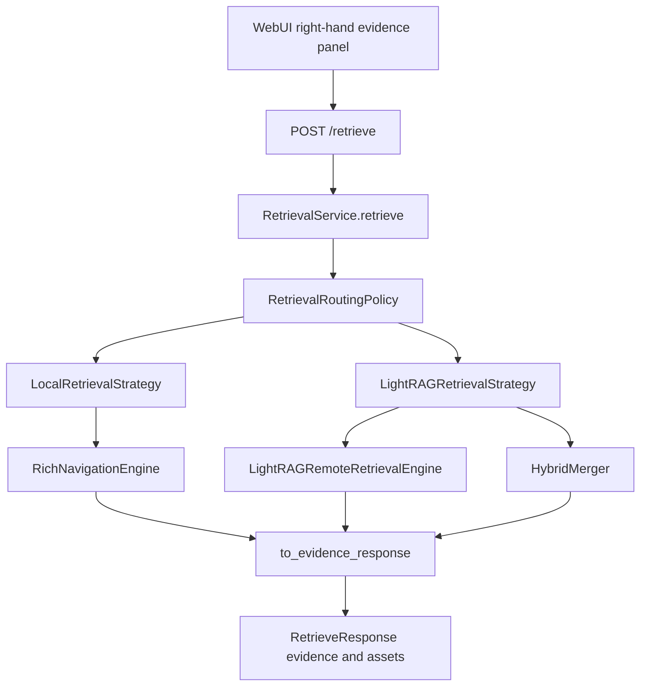

# Implement Evidence Panel Backend Support

## Current Backend Baseline

The backend already has the evidence-only route the WebUI should use:

```text
POST /retrieve
```

`app/api/routes/retrieve.py` is intentionally thin. It accepts `RetrieveRequest`, uses the existing auth and database dependencies, and delegates to:

```python
RetrievalService(session).retrieve(request=request, user=user)
```

Do not add another retrieval path, another LightRAG client, or a WebUI-to-LightRAG shortcut.

The previous `/query/*` routes are not part of the current backend surface. `tests/test_api.py` asserts that `/query`, `/query/answer`, and `/query/retrieve` return 404. Future evidence-panel work should align with that retrieve-only direction instead of restoring `/query/retrieve` as an alias.

## Existing Evidence Flow



The current response contract is defined in `app/schemas/retrieval.py`:

- `RetrieveRequest`: query, mode, optional document/domain scope, debug flag, and asset flags.
- `EvidenceResponse`: evidence id, document id, source engine, text, score, page range, section title, display helpers, and metadata.
- `AssetResponse`: asset id, document id, type, caption, page, URL, and thumbnail URL.
- `RetrieveResponse`: query, mode, ordered evidence, optional assets, and admin-only debug.

## Key Tensions And Decisions

### 1. API Surface

Decision: use retrieve-only.

The right-hand panel should call `POST /retrieve`. Documentation, prompts, and tests should not require `/query/retrieve` compatibility. If a future product requirement needs a compatibility alias, that should be a deliberate new decision with a test change, not assumed migration work.

### 2. Evidence Display Fields

Current state: evidence cards can render common display helpers from top-level fields.

The backend now projects these metadata values into explicit top-level fields when present:

- `source_path`
- `document_title`
- `chunk_id`
- `reference_id`

Keep `metadata` as raw optional context, but do not make the WebUI parse deeply nested metadata for core card display.

### 3. Document Title Ownership

Current state: retrieval does not populate `document_title`.

Decision needed before implementation: choose one owner.

- Metadata-owned: use `metadata["document_title"]` if upstream retrieval already supplies it.
- Backend-owned: enrich evidence in `RetrievalService` from `DocumentRepository` filenames. (RECOMMENDED)
- WebUI-owned fallback: render `document_id` or `source_path` until a title API is needed.

Prefer backend-owned enrichment if the panel requires consistent human-readable labels across semantic and navigation evidence.

### 4. Asset Linkage

Current state: assets are returned as top-level `assets[]` only when `include_assets=true`.

Tension: the WebUI must correlate evidence cards with related thumbnails without assuming assets are nested under each evidence item.

Recommended v1 rule: keep assets top-level and use evidence metadata such as `asset_ids`, `chunk_id`, page range, and document id for correlation. Only add an explicit `evidence_id -> asset_ids` response field if the first WebUI implementation proves the correlation is ambiguous.

### 5. Debug Visibility

Current state: `RetrievalService` returns `debug` only when `include_debug=true` and the authenticated user is an admin.

Decision: preserve this as a public `/retrieve` behavior. Future tests should verify normal users receive `debug: null` even if they request debug output.

### 6. Workspace Tree Boundary

The workspace tree supports browsing and scope selection. The evidence panel reports per-query retrieval evidence.

Keep these concepts separate:

- Left-side/domain browser: workspace tree route and document structure APIs.
- Right-hand evidence panel: `POST /retrieve` response evidence and assets.

## Future Backend Implementation Sequence

Use vertical TDD slices. Do not write every imagined test before implementation.

### Slice 1: Display Field Projection

Behavior: evidence cards can read one agreed display helper from the top-level evidence item.

Status: implemented for `source_path`, `document_title`, `chunk_id`, and `reference_id`.

The implementation added mapper/API coverage first, then added the smallest schema and mapper changes.

Likely files:

```text
app/schemas/retrieval.py
app/retrieval/evidence_mapper.py
tests/test_evidence_mapper.py
```

### Slice 2: Public Retrieve Contract

Behavior: `/retrieve` exposes stable panel behavior through the public API.

Status: partially implemented for:

- authenticated users receive `RetrieveResponse`
- unauthenticated requests fail with the existing auth behavior
- empty evidence returns 200 with `evidence: []` and `assets: []`
- normal users cannot receive debug output
- admins can receive debug output when requested

Remaining future work should focus on additional WebUI-driven contract gaps rather than duplicating these tests.

Likely files:

```text
tests/test_api.py
app/services/retrieval_service.py
```

### Slice 3: Asset Correlation

Behavior: the panel can show relevant figure/table/image thumbnails without stale or unrelated assets.

Start with the existing top-level asset behavior. Add a stronger contract only if WebUI implementation shows that metadata plus top-level `assets[]` is insufficient.

Likely files:

```text
app/services/retrieval_asset_resolver.py
tests/test_retrieval_asset_enrichment.py
tests/test_api.py
```

## Documentation Acceptance Criteria

- Package docs identify `POST /retrieve` as the canonical evidence-panel endpoint.
- Docs no longer require `/query/retrieve` to work.
- Remaining backend work is framed as schema/mapper/test extension, not route creation.
- Future implementation instructions use public behavior tests and vertical TDD slices.
- WebUI guidance still forbids raw LightRAG responses and direct WebUI-to-LightRAG calls.

## Implementation Acceptance Criteria

Use these only when the future code work is approved:

- `POST /retrieve` remains the only evidence retrieval endpoint.
- The route still delegates to `RetrievalService.retrieve(...)`.
- Evidence items expose only stable top-level fields needed by the panel.
- `metadata` remains available for raw optional context.
- Assets remain opt-in through `include_assets`.
- Admin-only debug behavior is preserved.
- `python -m pytest -q` passes.
