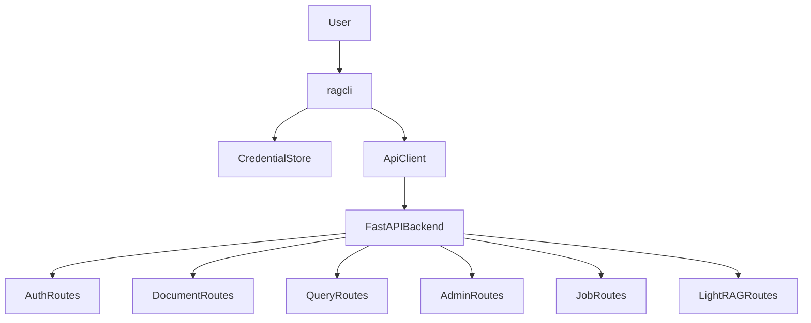

# ragcli Documentation

`ragcli` is the command-line client for the Context Engine backend. It is intentionally thin: it authenticates, stores a backend session token, calls FastAPI routes, and renders either human-oriented output or stable JSON.

The CLI targets the current unversioned backend route contract. Examples use paths such as `/auth/login`, `/documents`, `/query/retrieve`, `/admin/documents/upload`, `/jobs/{job_id}`, `/graphs`, and `/graph/label/...`.

## Install For Local Development

```bash
python -m pip install -e ".[dev]"
```

Run the backend separately:

```bash
python -m uvicorn app.main:create_app --factory --reload
```

Then use the CLI:

```bash
ragcli --api-base-url http://127.0.0.1:8000 login --email admin@example.com
ragcli documents list
ragcli documents retrieve --query "where are installation steps"
ragcli admin documents upload --file ./manual.pdf
ragcli jobs status --job-id JOB_ID
```

After login, protected commands use the saved base URL from the session. If a later command passes a different `--api-base-url`, `ragcli` warns and continues using the saved session URL until you log in again.

## Output Modes

Every command supports:

```bash
--output human
--output json
```

JSON output is the stable automation contract. Human output is for operators; many commands currently render pretty-printed JSON or simple Rich tables rather than prose.

## Command Groups

- `login`, `logout`, `auth me`: session lifecycle and current user inspection.
- `documents`: document list/detail/structure/page retrieval, retrieval queries, and answers.
- `query`: top-level answer shortcut.
- `admin documents`: admin-only document upload, index, reindex, delete, and full document listing.
- `admin audit-logs`, `admin query-logs`: admin-only observability logs.
- `jobs`: admin-only indexing job list/detail/retry.
- `lightrag`: LightRAG graph and label reads through backend API routes. These require backend LightRAG configuration; the CLI never connects to LightRAG directly.
- `users`, `agents`, `retrievers`, `conversations`, `messages`, `chat`, `runs`, `approvals`, and corpus version commands: reserved planned surface that returns `not_supported_by_backend` until matching FastAPI routes exist.

API-first LightRAG deployment/domain administration remains future backend work, documented under `docs/cli_docs/api_first_cli/`.

## Current Flow



## Design Constraints

- Do not store passwords.
- Do not print access tokens.
- Prefer OS keyring for tokens and warn when falling back to a local file.
- Keep backend business rules in the backend.
- Every real command should mirror a backend route.
- Planned commands should fail explicitly instead of inventing local behavior.
