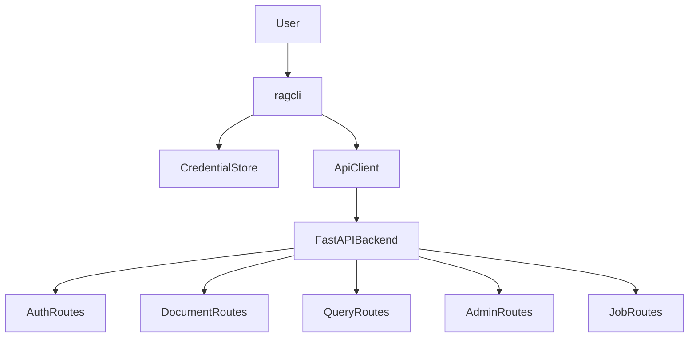

# ragcli Documentation

`ragcli` is the command-line client for the context-engine backend. It is intentionally thin: it authenticates, stores a backend session token, calls the FastAPI API, and renders either human-readable output or stable JSON.

The CLI targets the current backend route contract. Routes are unversioned in this codebase, so examples use paths such as `/auth/login`, `/documents`, `/query/retrieve`, `/admin/documents/upload`, and `/jobs/{job_id}`.

## Install For Local Development

```bash
python -m pip install -e ".[dev]"
```

Run the backend separately:

```bash
python -m uvicorn app.main:app --reload
```

Then use the CLI:

```bash
ragcli --api-base-url http://127.0.0.1:8000 login --email admin@example.com
ragcli documents list
ragcli documents retrieve --query "where are installation steps"
ragcli admin documents upload --file ./manual.pdf
ragcli jobs status --job-id JOB_ID
```

## Output Modes

Every command supports:

```bash
--output human
--output json
```

Human output is for operators. JSON output is the stable automation contract and should be used by scripts, tests, and future UI wrappers.

## Command Groups

- `login`, `logout`: local session lifecycle.
- `documents`: document list/detail/structure/page retrieval and retrieval queries.
- `admin documents`: admin-only document upload, index, reindex, delete, and full document listing.
- `jobs`: admin-only indexing job list/detail/retry.
- `users`, `agents`, `retrievers`, `conversations`, `messages`, `chat`, `runs`, `approvals`, and corpus version commands: documented as planned surface until matching backend routes exist.

## Current Flow



## Design Constraints

- Do not store passwords.
- Do not print access tokens.
- Prefer OS keyring for tokens and warn when falling back to a local file.
- Keep backend business rules in the backend.
- Add behavior one vertical TDD slice at a time.
