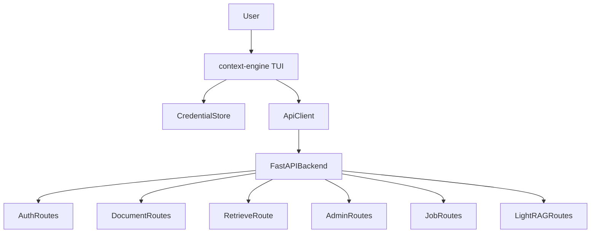

# context-engine Terminal Client

The **`context-engine`** and **`context-tui`** commands (same implementation, `cli.launcher:main`) are the supported operator interface for Context Engine: a **Rich-only interactive terminal UI**. They authenticate via the REST API, store a bearer token locally, call FastAPI routes through `cli/api_client.py` (`cli/services/*` wrappers), and never embed backend business logic.

Automation and CI should prefer **calling the REST API directly** (`curl`, HTTP libraries). The launcher is geared toward guided human operation.

Examples use backend paths such as `/auth/login`, `/documents`, `/retrieve`, `/admin/documents/upload`, `/jobs/{job_id}`, `/graphs`, `/graph/label/…`, `/lightrag/domains`, and `/admin/lightrag/domains`.

## Install For Local Development

```bash
python -m pip install -e ".[dev]"
```

Run the backend separately:

```bash
uvicorn app.main:create_app --factory --reload
```

Then start the interactive client:

```bash
context-engine
# same entry point:
context-tui --api-base-url http://127.0.0.1:8010
```

Launcher options (see `cli/config.py`):

- **`--api-base-url`**, or **`CONTEXT_ENGINE_API_BASE_URL`** in the environment  
- **`--config-dir`** (defaults to `~/.context-engine/cli/` for credential files)  
- **`--keyring`** / **`--no-keyring`**

Sign in via the Login screen inside the UI. Stored sessions keep the backend base URL; if you later launch against a mismatched **`--api-base-url`**, the session flow warns and keeps using the URL from sign-in until you log out/sign in again.

## Output Modes

There is **no** global `--output human|json` flag on the launcher. Scripted JSON access should use **`GET`/`POST`** against FastAPI endpoints and parse JSON responses directly.

Screens may show compact tables or excerpts; richer shapes come from backend responses surfaced read-only.

## Capability Areas (menus / flows)

Rough map to menus in the UI (exact labels follow `cli/tui/`):

- Session: stored session summary · `GET /auth/me`
- Documents: browse document library, structure/page views
- Documents Admin Actions: nested under Documents for admin users (upload/list/index/reindex/delete)
- Retrieval: `POST /retrieve` only
- Graphs: graph/label summaries via backend proxies when configured
- LightRAG Domains: admin lifecycle screens for list, create, start, stop, recreate, archive remove, and permanent delete
- Jobs: list/detail/retry for admin-visible jobs
- Observability: audit and query logs (admin; read-only in UI)
- Health / readiness shortcuts where wired
- Backend gaps: documented in `docs/cli_docs/backend_gaps.md`; not exposed as a root TUI screen

LightRAG domain administration is TUI-first for human operators and REST-first for automation. Domain deployment requires backend settings such as **`LIGHTRAG_DEPLOY_ENABLED=true`** plus the Docker/image/storage variables documented in **`.env.example`**. Runtime LightRAG is mandatory: **`LIGHTRAG_ENABLED=true`**, plus **`LIGHTRAG_BASE_URL`** or a readable domain manifest, and optional **`LIGHTRAG_API_KEY`**.

API-backed screens keep default views clean. Use **`I`** for Inspect API, **`J`** for Raw JSON, **`F`** for full IDs, and **`R`** to refresh. Inspect/raw views redact secrets and never show multipart file bytes.

## Current Flow



## Design Constraints

- Do not persist passwords locally.
- Do not print bearer tokens into the transcript.
- Prefer OS keyring for tokens (`--no-keyring` forces file-backed storage with a stderr warning naming the fallback file).
- Keep backend business rules behind FastAPI handlers.
- Planned-only backend capabilities must surface explicitly as gaps or errors—never fabricated success locally.
